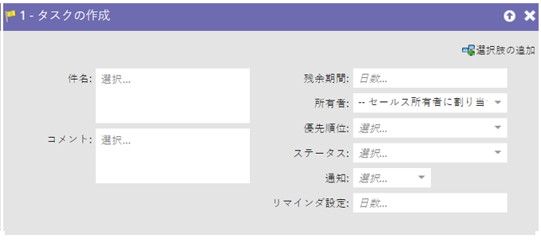
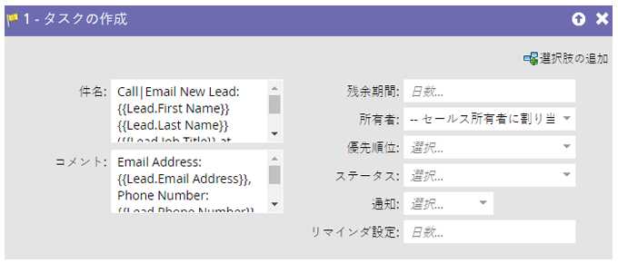
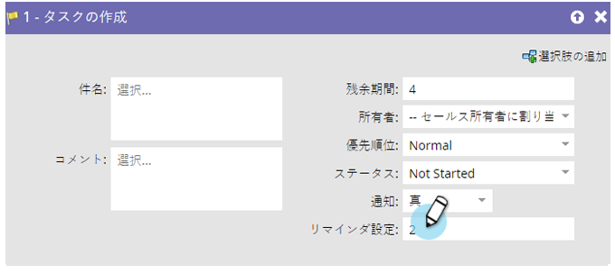

# タスクの作成 {#create-task}

マーケターは、取引の成立に関して営業を支援できる情報を持っています。タスクを作成して、タスクの実行内容と実行タイミングを営業に知らせることができます。

>[!NOTE]
>
>Marketo 同期ユーザーがタスクを作成する場合、Salesforce でタスクを作成するには「**[!UICONTROL 期限]**」が必須フィールドです。この値がない場合、Marketo でデフォルトの 5 日が自動入力されます。

デフォルトでは、フローステップは次のようになります。

すべてのフィールドをカスタマイズして、目的のタスクを作成します。

>[!TIP]
>
>**[!UICONTROL 件名]**&#x200B;と&#x200B;**[!UICONTROL 説明]**&#x200B;で、`{{lead.tokens}}`、`{{company.tokens}}`、`{{campaign.tokens}}`、`{{system.tokens}}` を使用できます。詳しくは、[フローステップのトークン](/help/marketo/product-docs/core-marketo-concepts/smart-campaigns/flow-actions/use-tokens-in-flow-steps.md){target="_blank"}を参照してください。
