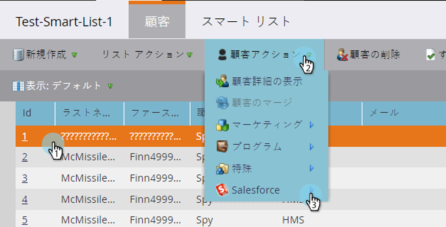
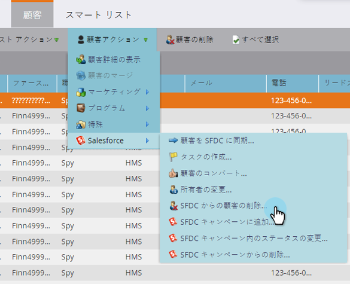
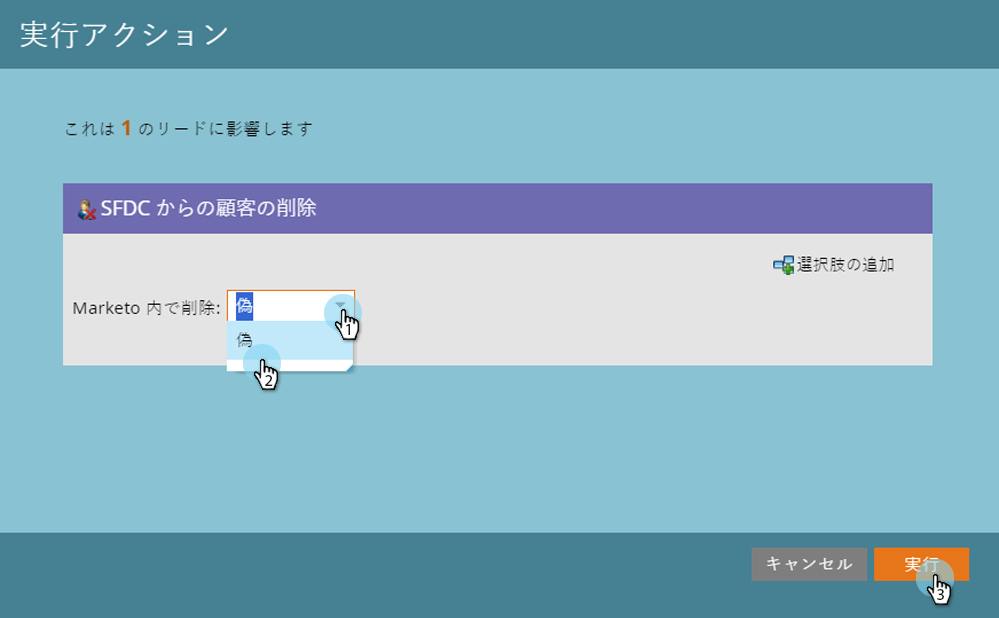

# SFDC からの顧客の削除 {#delete-person-from-sfdc}

特定のリードのセットを Marketo Engage に人物として残しつつ、Salesforce から削除したい場合は、「SFDC から顧客を削除」フローアクションを使用できます。

>[!NOTE]
>
>[!DNL Salesforce] と統合されている場合にのみ使用できます。

1. データベースで、Salesforce から削除するリードをクリックします。「**[!UICONTROL 人物のアクション]**」をクリックし、「**[!DNL Salesforce]**」を選択します。

   

1. 「**[!UICONTROL SFDC から顧客を削除]**」を選択します。

   

1. 「**[!UICONTROL Marketo 内で削除]**」設定が **[!UICONTROL false]** になっていることを確認したら、「**[!UICONTROL 実行]**」をクリックします。

   

   フローステップが実行されると、そのユーザーは [!DNL Salesforce] ではリードではなくなり、Marketoには残ります。

   >[!CAUTION]
   >
   >「**[!UICONTROL Marketo 内で削除]**」を **[!UICONTROL true]** に設定して、Salesforce と Marketo の両方からリードを削除すると、リードデータは完全に失われ、元に戻すことはできません。このアクションをやり直すことはできません。
