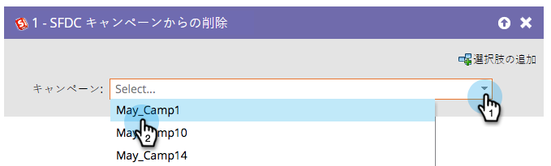

# SFDC キャンペーンからの削除 {#remove-from-sfdc-campaign}

[SFDC キャンペーンに追加](/help/marketo/product-docs/core-marketo-concepts/smart-campaigns/salesforce-flow-actions/add-to-sfdc-campaign.md){target="_blank"}したり、[SFDC キャンペーンのステータスを変更](/help/marketo/product-docs/core-marketo-concepts/smart-campaigns/salesforce-flow-actions/change-status-in-sfdc-campaign.md){target="_blank"}したりできるように、Salesforce キャンペーンから人物やリードを削除することもできます。

>[!NOTE]
>
>[!DNL Salesforce] と統合されている場合にのみ使用できます。

1. フローステップにドラッグしたら、人物またはリードを削除する Salesforce キャンペーンを探して選択します。

   

   >[!TIP]
   >
   >人物またはリードが選択したキャンペーンのメンバーではない場合はスキップされます。

これで完了です。ユーザーまたはリードがフロースルーすると、選択した [!DNL Salesforce] キャンペーンから削除されます。
