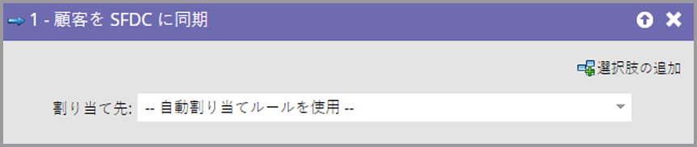

# 個人を SFDC に同期する {#sync-person-to-sfdc}

このフローステップは、Marketo が作成した人物を Salesforce CRM に挿入するものです。

>[!NOTE]
>
>[!DNL Salesforce] と統合されている場合にのみ使用できます。

1. デフォルトでは、このフローステップは、Salesforce 自動割り当てルールに基づいてリード所有者に割り当てます。

   

   >[!TIP]
   >
   >[!DNL Salesforce] では、人物の「会社」と「姓」のフィールドが入力されている必要があります。入力されていない場合、リードレコードは拒否されます。

1. 特定の [!DNL Salesforce] ユーザまたはリードのキューをリード所有者として設定できます。

   

   このフローステップを使用する場合、人物は [!DNL Salesforce] のリードとして即座に同期され、通常の同期を待つ必要はありません。

   >[!CAUTION]
   >
   >[!DNL Salesforce] では「取引先責任者」をリードのキューに割り当てることはできません。この場合、Marketo は [!DNL Salesforce] で「リード」を重複して作成します。
