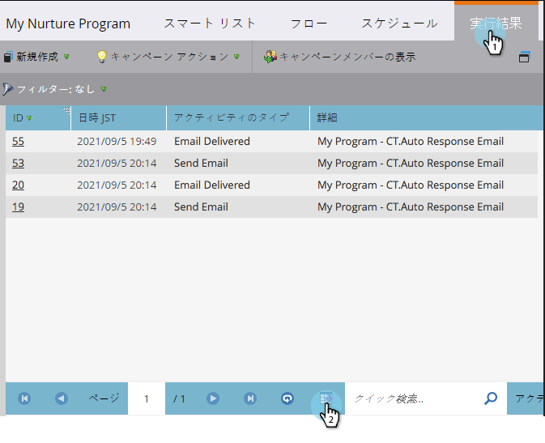

# スマートキャンペーンの結果をExcelにエクスポート {#export-smart-campaign-results-to-excel}

スマートキャンペーンの結果をExcelにエクスポートし、Marketoの外部で使用できるようにします。

1. スマートキャンペーンーで、「 **結果** 」をクリックし、下部にある書き出しアイコンをクリックします。

   

   すぐに結果がエクスポートされ、使用できる状態になります。

   >[!NOTE]
   >
   >エクスポートの行数は20,000行までに制限されます。 Excelファイルは、ブラウザのデフォルトのダウンロードフォルダーに保存されます。

