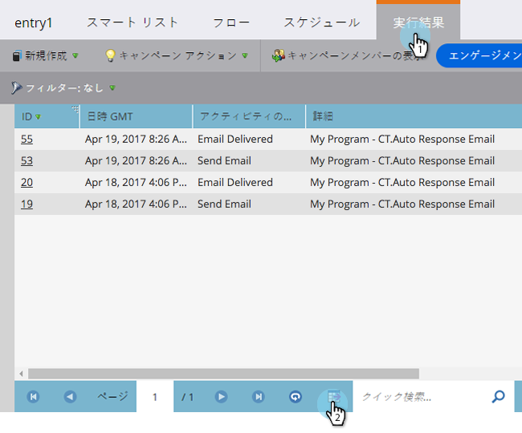

# スマートキャンペーン結果を [!DNL Excel] に書き出し {#export-smart-campaign-results-to-excel}

スマートキャンペーンの結果を Excel にエクスポートして、Marketo Engage 以外で使用できるようにします。

1. スマートキャンペーンで、「**[!UICONTROL 結果]**」タブをクリックし、下部にあるエクスポートアイコンをクリックします。

   

   結果がエクスポートされ、使用できる状態になります。

   >[!NOTE]
   >
   >書き出しの行数は 20,000 行に制限されます。 [!DNL Excel] ファイルは、ブラウザーのデフォルトのダウンロードフォルダーに保存されます。
