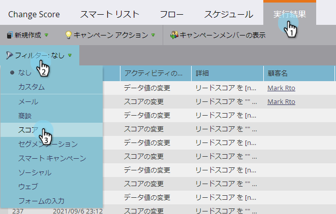
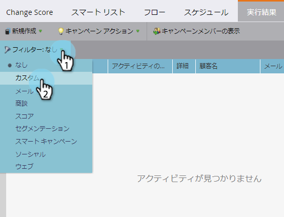
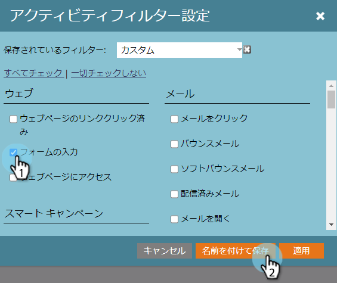
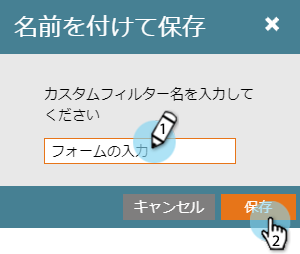
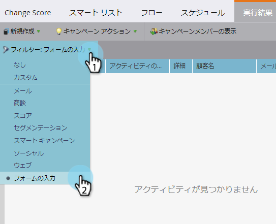

# スマートキャンペーン結果のフィルター {#filter-smart-campaign-results}

>[!PREREQUISITES]
>
>* [表示スマートキャンペーンの結果](view-smart-campaign-results.md)

>

スマートキャンペーンの結果をフィルターして、重要な特定のアクティビティを確認します。

## 保存済みフィルターでフィルター {#filter-by-saved-filters}

1. 「スマートキャンペーン **結果** 」タブで、「 **フィルタ** 」をクリックし、保存済みフィルタを選択します。

   

   >[!NOTE]
   >
   >デフォルトでは、フィルターは適用されず、結果にすべてのアクティビティが表示されます。

## カスタムフィルターの作成 {#create-a-custom-filter}

1. 「 **Filter** 」、「 **Custom**」の順にクリックします。

   

1. 表示するアクティビティタイプを選択し、「名前を付けて **保存** 」をクリックします。

   

   >[!TIP]
   >
   >カスタムフィルターを保存せずに結果に直接適用するには、 **「Apply** 」をクリックします。

1. フィルター名を入力し、「 **保存**」をクリックします。

   

1. カスタムフィルターが結果に適用され、ドロップダウンで使用できるようになります。 （ドロップダウンに表示するには、ページを更新する必要がある場合があります）。

   

   それは涼しいでしょ？ これで、カスタムフィルターがすべてのアクティビティログで使用できるようになります。

