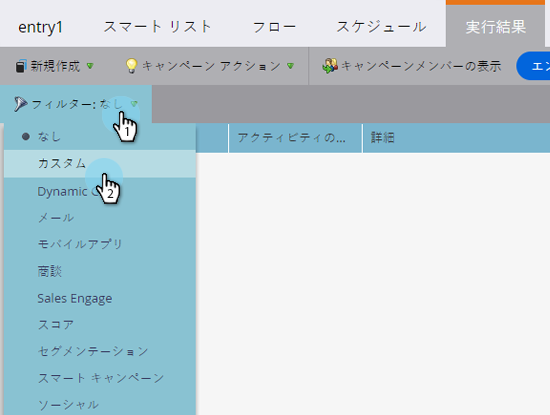

# スマートキャンペーン結果のフィルタリング {#filter-smart-campaign-results}

>[!PREREQUISITES]
>
>[スマートキャンペーン結果の表示](/help/marketo/product-docs/core-marketo-concepts/smart-campaigns/smart-campaign-data/view-smart-campaign-results.md)

スマートキャンペーンの結果をフィルタリングして、重要な特定のアクティビティを確認します。

## 保存済みフィルターでフィルタリング {#filter-by-saved-filters}

1. スマートキャンペーンの「**[!UICONTROL 結果]**」タブで、「**[!UICONTROL フィルター]**」をクリックし、保存済みフィルターを選択します。

   

   >[!NOTE]
   >
   >デフォルトでは、フィルターは適用されておらず、結果にすべてのアクティビティが表示されます。

## カスタムフィルターの作成 {#create-a-custom-filter}

1. 「**[!UICONTROL フィルター]**」、「**[!UICONTROL カスタム]**」の順にクリックします。

   

1. 表示するアクティビティタイプを選択し、「**[!UICONTROL 別名で保存]**」をクリックします。

   

   >[!TIP]
   >
   >「**[!UICONTROL 適用]**」をクリックすると、カスタムフィルターを保存せずに結果に直接適用できます。

1. フィルター名を入力し、「**[!UICONTROL 保存]**」をクリックします。

   

1. カスタムフィルターが結果に適用され、さらにドロップダウンで使用できるようになります（ドロップダウンで表示するには、ページを更新する必要が生じる場合もあります）。

   
