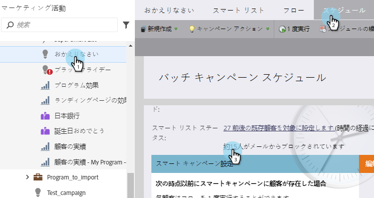
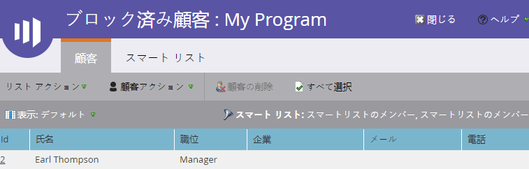

# スマートキャンペーンでユーザーをブロックした表示{#view-blocked-people-in-a-smart-campaign}

Marketoデータベース内のブロックされたユーザーは、マーク、登録解除、マーケティングのブロックリストに加える停止、または無効な電子メールや空の電子メールを受け取ります。

>[!NOTE]
>
>マーケティング担当者は、ブラックリストやホワイトリストなどの用語を、当社の製品のブロックリスト許可リストやに変更する過程にあります。 この更新中、UIとドキュメントのスクリーンショットには古い用語が表示され、ドキュメントのテキストには新しい用語が表示される場合があります。 ご混乱をおかけして申し訳ございません。

1. スマートキャンペーンで、**スケジュール**&#x200B;をクリックします。 「**スマートリストの状態**」で、2番目のリンクをクリックします。

   

   >[!NOTE]
   >
   >また、通信制限に達した人がメールの受信をブロックされる場合もあります。 管理セクションで[通信制限](/help/marketo/product-docs/administration/email-setup/enable-communication-limits.md)を編集する方法を説明します。

   [ブロックされた人]タブには、メールを受信しない可能性のある人が表示されます。

   

   >[!NOTE]
   >
   >未登録とマークされ、マーケティングが停止されたユーザーに、操作用の電子メールが送信されます。

   >[!MORELIKETHIS]
   >
   >* [資格ルールの編集](/help/marketo/product-docs/core-marketo-concepts/smart-campaigns/using-smart-campaigns/edit-qualification-rules-in-a-smart-campaign.md)
   >* [通信制限を有効にする](/help/marketo/product-docs/administration/email-setup/enable-communication-limits.md)
   >* [表示スマートキャンペーンメンバ](/help/marketo/product-docs/core-marketo-concepts/smart-campaigns/smart-campaign-data/view-smart-campaign-members.md)
   >* [スマートキャンペーンの表示資格者](/help/marketo/product-docs/core-marketo-concepts/smart-campaigns/smart-campaign-data/view-qualified-people-in-a-smart-campaign.md)

行くぞ！ これで、誰が郵送物を受け取らないかを知ることができます。
