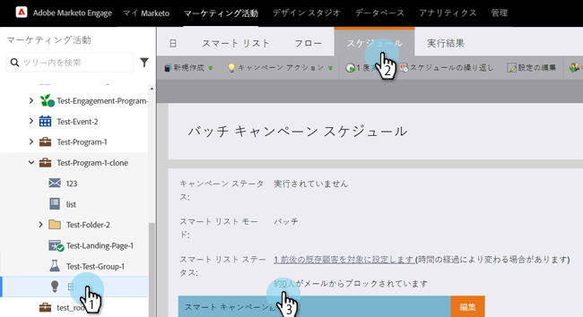
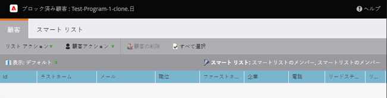

# スマートキャンペーンでのブロックされた人物の表示 {#view-blocked-people-in-a-smart-campaign}

Marketo Engage データベースで、ブロックリスト登録済み、登録解除済み、マーケティング中断、無効または空のメールアドレスの人物はブロックされます。

1. スマートキャンペーンで、「**[!UICONTROL スケジュール]**」をクリックします。「**[!UICONTROL スマートリストのステータス]**」で 2 つ目のリンクをクリックします。

   

   >[!NOTE]
   >
   >通信制限に達したユーザーがメール受信をブロックされる場合もあります。「管理者」セクションの[通信制限を編集](/help/marketo/product-docs/administration/email-setup/enable-communication-limits.md){target="_blank"}で、方法を参照してください。

   「**[!UICONTROL ブロック済みのリード]**」タブには、メールを受信しない可能性のある人物が表示されます。

   

   >[!NOTE]
   >
   >オペレーショナルなメールは、登録解除済みのリードとマーケティングを中断したリードに引き続き送信されます。

   >[!MORELIKETHIS]
   >
   >* [クオリフィケーションルールの編集](/help/marketo/product-docs/core-marketo-concepts/smart-campaigns/using-smart-campaigns/edit-qualification-rules-in-a-smart-campaign.md){target="_blank"}
   >* [通信制限の有効化](/help/marketo/product-docs/administration/email-setup/enable-communication-limits.md){target="_blank"}
   >* [スマートキャンペーンメンバーの表示](/help/marketo/product-docs/core-marketo-concepts/smart-campaigns/smart-campaign-data/view-smart-campaign-members.md){target="_blank"}
   >* [スマートキャンペーンの条件を満たす人物の表示](/help/marketo/product-docs/core-marketo-concepts/smart-campaigns/smart-campaign-data/view-qualified-people-in-a-smart-campaign.md){target="_blank"}
