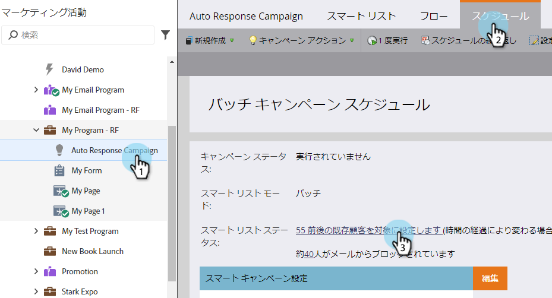
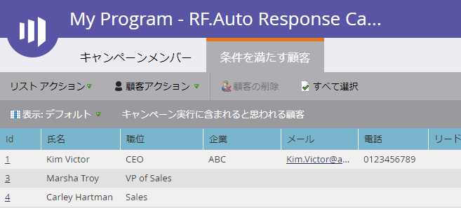

# スマートキャンペーンの表示資格者{#view-qualified-people-in-a-smart-campaign}

スマートキャンペーンを実行する場合に、フローを通過する資格を持つ表示担当者。

1. スマートキャンペーンで、「予定」をクリックします。 「スマートリストのステータス」で、最初のリンクをクリックします。

>[!NOTE]
>
>スマートキャンペーンのトリガーは、実イベントに基づいて実行されるので、資格のある人を表示しません。

1. 「**資格を持つ人**」タブには、キャンペーンの実行時にフローを通過する資格を持つ人のリストが表示されます。

   

   >[!CAUTION]
   >
   >資格を持つユーザーリストは、ブロックされたユーザーや通信制限に達したユーザーを考慮しません。

   >[!NOTE]
   >
   >資格を持つ人の数も、スマートキャンペーン資格ルールによって異なります。 [資格ルール](../../../../product-docs/core-marketo-concepts/smart-campaigns/using-smart-campaigns/edit-qualification-rules-in-a-smart-campaign.md)を編集する方法を学びます。

甘い！ このリストを使用すると、スマートキャンペーンを実行する前に、どの訪問者がフローを通過したかを確認できます。

>[!MORELIKETHIS]
>
>* [表示スマートキャンペーンメンバ](view-smart-campaign-members.md)
>* [スマートキャンペーンで人をブロックした表示](view-blocked-people-in-a-smart-campaign.md)
>* [スマ追加ートキャンペーンへのフローステップ](../../../../product-docs/core-marketo-concepts/smart-campaigns/flow-actions/add-a-flow-step-to-a-smart-campaign.md)

>

