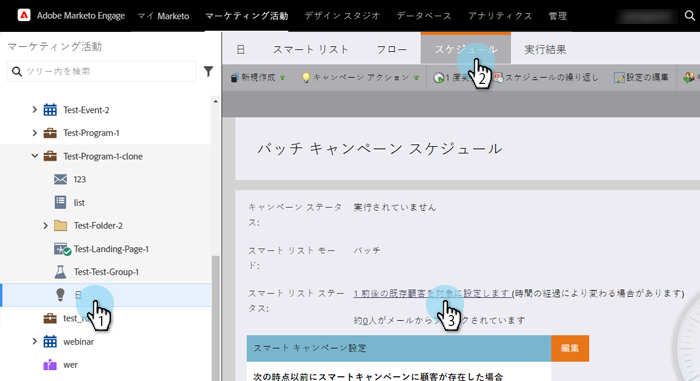
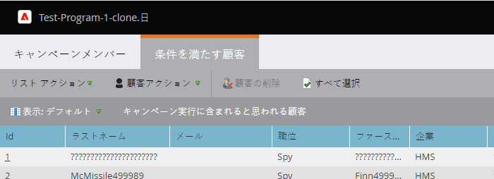

# スマートキャンペーンの条件を満たす人物の表示 {#view-qualified-people-in-a-smart-campaign}

Smart Campaign を実行する際にフローを通過する資格を持つユーザーを表示します。

1. スマートキャンペーンで、「**[!UICONTROL スケジュール]**」タブをクリックします。 「スマート・リスト・ステータス」で、最初のリンクをクリックします。

>[!NOTE]
>
>トリガーキャンペーンはライブイベントに基づいて実行されるので、有資格者は表示されません。

1. 「**[!UICONTROL 条件を満たす人物]**」タブには、キャンペーン実行時にフローを通過する条件を満たす人の一覧が表示されます。

   

   >[!CAUTION]
   >
   >条件を満たす人物リストは、ブロックされた人や通信制限に達した人を考慮しません。

   >[!NOTE]
   >
   >また、認定されるユーザーの数は、Smart Campaign の認定ルールにも依存します。 詳しくは、[クオリフィケーションルールを編集](/help/marketo/product-docs/core-marketo-concepts/smart-campaigns/using-smart-campaigns/edit-qualification-rules-in-a-smart-campaign.md){target="_blank"}を参照してください。

作業は以上です。このリストを使用すると、スマートキャンペーンを実行する前に、どのユーザーがフローを通過する可能性があるかを確認できます。

>[!MORELIKETHIS]
>
>* [スマートキャンペーンメンバーの表示](/help/marketo/product-docs/core-marketo-concepts/smart-campaigns/smart-campaign-data/view-smart-campaign-members.md){target="_blank"}
>* [スマートキャンペーンでのブロックされた人物の表示](/help/marketo/product-docs/core-marketo-concepts/smart-campaigns/smart-campaign-data/view-blocked-people-in-a-smart-campaign.md){target="_blank"}
>* [スマートキャンペーンへのフローステップの追加](/help/marketo/product-docs/core-marketo-concepts/smart-campaigns/flow-actions/add-a-flow-step-to-a-smart-campaign.md){target="_blank"}
