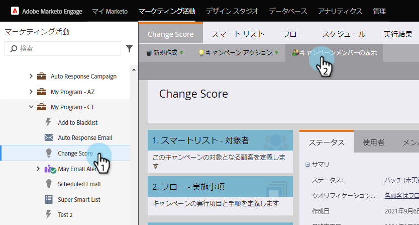
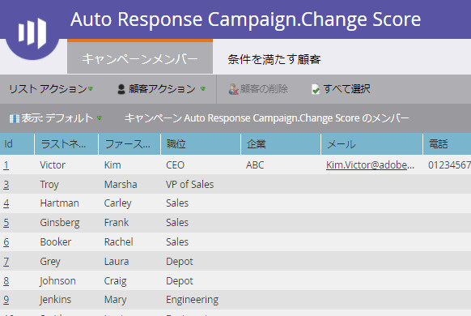

# 表示スマートキャンペーンメンバ{#view-smart-campaign-members}

すでにスマートキャンペーンの流れを経ている表示者例えば、スマート・キャンペーン・メンバー。

1. 「マーケティングアクティビティ」に移動します。

1. スマートキャンペーンで、[表示キャンペーンメンバ]をクリックします。

   

>[!TIP]
>
>スマートキャンペーン内の任意の場所からキャンペーンメンバーを表示できます。

1. 「**キャンペーンメンバー**」タブには、スマートキャンペーンフローを既に経由しているユーザーが表示されます。

   

   >[!NOTE]
   >
   >スマートキャンペーンがどのユーザーにも対して実行されていない場合、キャンペーンメンバーリストは、最初は空になります。

   >[!NOTE]
   >
   >**ディープダイブ**
   >
   >
   >[リスト](http://docs.marketo.com/display/docs/smart+lists+and+static+lists)で何ができるかを詳しく知る。

   >[!NOTE]
   >
   >**関連記事**
   >
   >    
   >    
   >    * [スマートキャンペーンで人をブロックした表示](view-blocked-people-in-a-smart-campaign.md)

