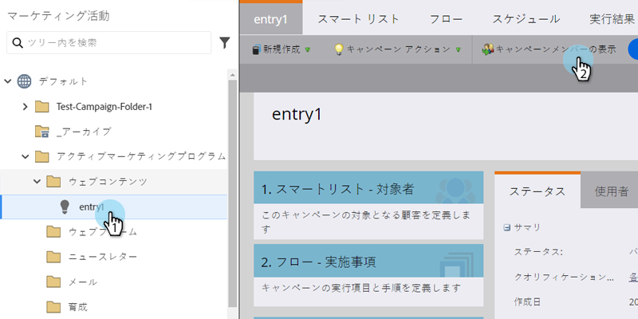
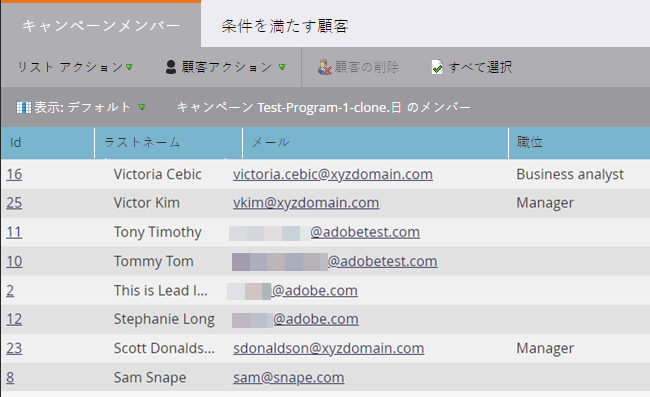

# スマートキャンペーンメンバーの表示 {#view-smart-campaign-members}

スマートキャンペーンフローを既に実行している人物を表示します。

1. 「**[!UICONTROL マーケティングアクティビティ]**」に移動します。

   

1. Smart Campaign で、「**[!UICONTROL キャンペーンメンバーを表示]**」をクリックします。

   

   >[!TIP]
   >
   >Smart Campaign 内のどこからでもキャンペーンメンバーを表示できます。

1. 「**[!UICONTROL キャンペーンメンバー]**」タブには、スマートキャンペーンフローを既に実行しているユーザーが表示されます。

   

   >[!NOTE]
   >
   >スマートキャンペーンが実行されないユーザーがいる場合、キャンペーンメンバーリストは最初、空になります。

   >[!MORELIKETHIS]
   >
   >[スマートキャンペーンでのブロックされた人物の表示](/help/marketo/product-docs/core-marketo-concepts/smart-campaigns/smart-campaign-data/view-blocked-people-in-a-smart-campaign.md){target="_blank"}
