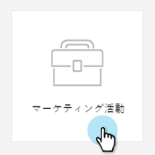
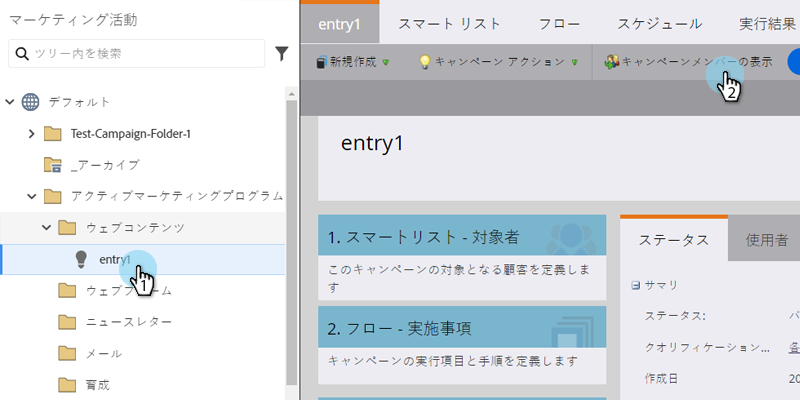
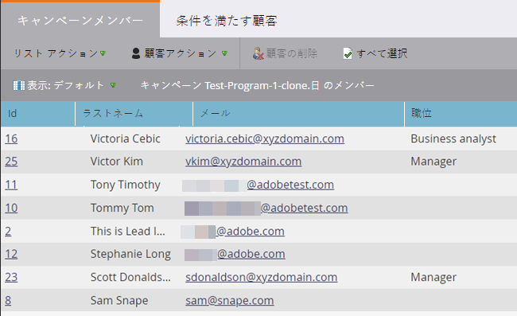

# スマートキャンペーンメンバーの表示 {#view-smart-campaign-members}

スマートキャンペーンフローを既に実行している人物を表示します。

1. **[!UICONTROL マーケティングアクティビティ]**&#x200B;に移動します。

   

1. スマートキャンペーンで、「**[!UICONTROL キャンペーンメンバーを表示]**」をクリックします。

   

   >[!TIP]
   >
   >スマートキャンペーン内の任意の場所からキャンペーンメンバーを表示できます。

1. この「**[!UICONTROL キャンペーンメンバー]**」タブには、スマートキャンペーンフローを既に実行している人物が表示されます。

   

   >[!NOTE]
   >
   >スマートキャンペーンがどの人物に対しても実行されていない場合、キャンペーンメンバーリストは最初は空になります。

   >[!MORELIKETHIS]
   >
   >[スマートキャンペーンでのブロックされた人物の表示](/help/marketo/product-docs/core-marketo-concepts/smart-campaigns/smart-campaign-data/view-blocked-people-in-a-smart-campaign.md){target="_blank"}
