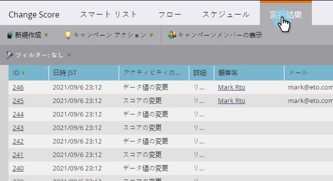
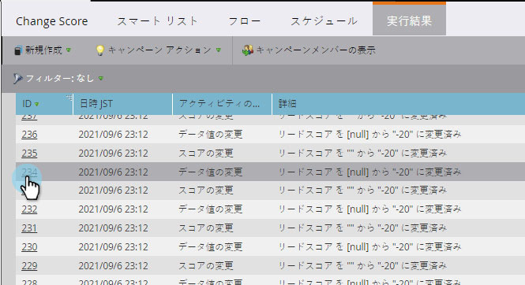

# 表示スマートキャンペーン結果{#view-smart-campaign-results}

スマートキャンペーンで起こったすべての内訳を確認したい 簡単です、次のようにします。

1. スマートキャンペーンーで、「**結果**」をクリックします。

   >[!TIP]
   >
   >スマートキャンペーンで処理されたユーザーのリストは、[[表示キャンペーンメンバー](/help/marketo/product-docs/core-marketo-concepts/smart-campaigns/smart-campaign-data/view-smart-campaign-members.md)]をクリックすると確認できます。

   

   >[!TIP]
   >
   >また、アクティビティタイプに基づいて結果をフィルタリングすることもできます。 [スマートキャンペーンの結果をフィルターする方法](/help/marketo/product-docs/core-marketo-concepts/smart-campaigns/smart-campaign-data/filter-smart-campaign-results.md)を説明します。

1. **ID**&#x200B;をクリックすると、そのアクティビティの詳細を表示できます。

   

   >[!TIP]
   >
   >表示の担当者の詳細は、その人の名前をクリックして表示します。

   結果を調べてキャンペーンが実際に何をしたかを確認するか、または[スマートキャンペーンの結果をExcel](/help/marketo/product-docs/core-marketo-concepts/smart-campaigns/smart-campaign-data/export-smart-campaign-results-to-excel.md)にエクスポートします。

   >[!MORELIKETHIS]
   >
   >[スマートキャンペーン結果のフィルター](/help/marketo/product-docs/core-marketo-concepts/smart-campaigns/smart-campaign-data/filter-smart-campaign-results.md)
