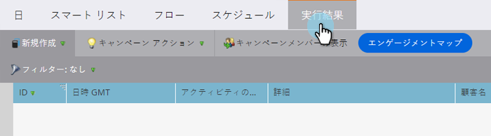
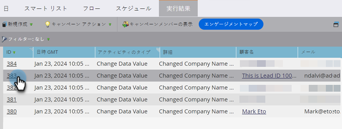

# スマートキャンペーン結果の表示 {#view-smart-campaign-results}

スマートキャンペーンで発生したすべての分類を表示するには、手順は次のとおりです。

>[!TIP]
>
>スマートキャンペーンで処理された人物のリストを表示するには、「[キャンペーンメンバーを表示](/help/marketo/product-docs/core-marketo-concepts/smart-campaigns/smart-campaign-data/view-smart-campaign-members.md){target="_blank"}」をクリックします。

1. スマートキャンペーンで、「**[!UICONTROL 結果]**」をクリックします。

   

   >[!TIP]
   >
   >また、アクティビティタイプに基づいて結果をフィルタリングすることもできます。詳しくは、[スマートキャンペーン結果のフィルタリング](/help/marketo/product-docs/core-marketo-concepts/smart-campaigns/smart-campaign-data/filter-smart-campaign-results.md){target="_blank"}を参照してください。

1. **[!UICONTROL ID]** をクリックして、特定のアクティビティの詳細を表示します。

   

   >[!TIP]
   >
   >人物の名前をクリックすると、人物の詳細が表示されます。

   結果を調べて、キャンペーンで実際に行ったことを確認するか、単純に[スマートキャンペーン結果を Excel に書き出し](/help/marketo/product-docs/core-marketo-concepts/smart-campaigns/smart-campaign-data/export-smart-campaign-results-to-excel.md){target="_blank"}ます。

   >[!MORELIKETHIS]
   >
   >[スマートキャンペーン結果のフィルタリング](/help/marketo/product-docs/core-marketo-concepts/smart-campaigns/smart-campaign-data/filter-smart-campaign-results.md){target="_blank"}
