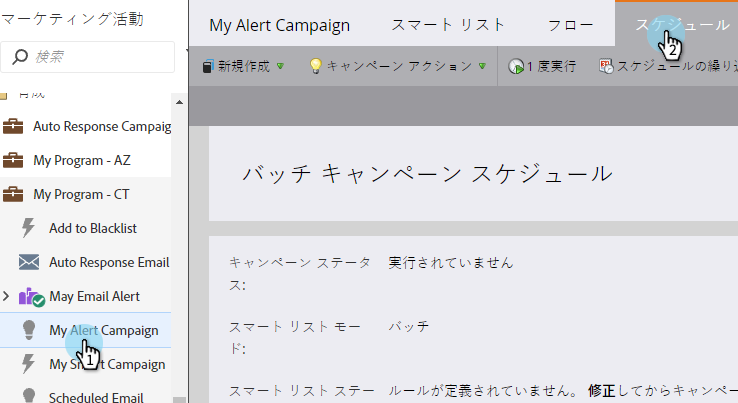
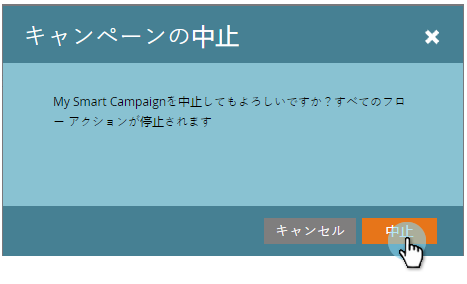
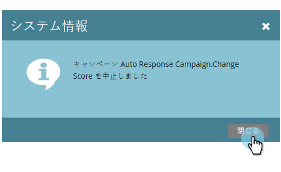

# スマートキャンペーンの中止{#abort-a-smart-campaign}

>[!CAUTION]
>
>緊急用

時には、スマートキャンペーンを起動して、それが誤りだとすぐに気付くことがあります。 緊急ブレーキを引き、スマートキャンペーンを中間作動で停止する方法を次に示します。

1. 「**マーケティングアクティビティ**」で、スマートキャンペーンを選択し、「**スケジュール**」タブに移動します。

   

1. **キャンペーンアクション**&#x200B;ドロップダウンをクリックします。 「**キャンペーンを中止**」を選択します。

   

1. 「**中止**」をクリックして確定します。

   

   >[!NOTE]
   >
   >中止は、既に完了した手順を元に戻しません。処理を中止するだけで、処理を停止できます。 (例：電子メールは配信を取り消すことはできません)。

   

   >[!NOTE]
   >
   >スマートキャンペーンの「**結果**」タブを調べて、中止の前に行われたアクションを確認します。 また、詳細を含む[通知](/help/marketo/product-docs/core-marketo-concepts/miscellaneous/understanding-notifications.md)も見つかります。

   >[!TIP]
   >
   >トリガーキャンペーンのフローから人を削除する場合 [Remove from Flow](/help/marketo/product-docs/core-marketo-concepts/smart-campaigns/flow-actions/remove-from-flow.md)をチェックアウトします。

常に重複チェックをしてくださいが、この緊急ブレーキは将来役に立つかもしれません。
