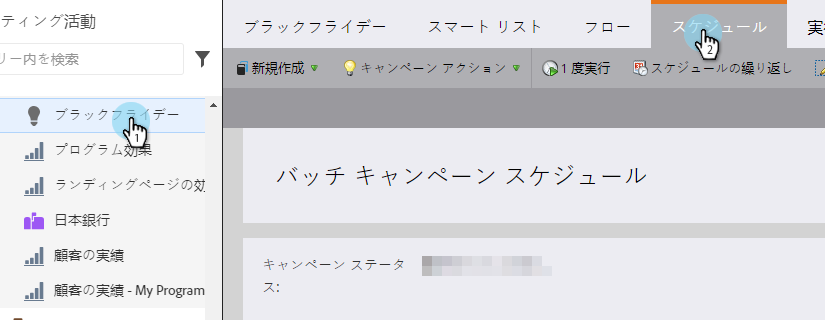
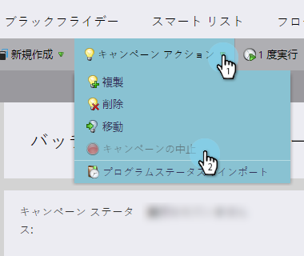
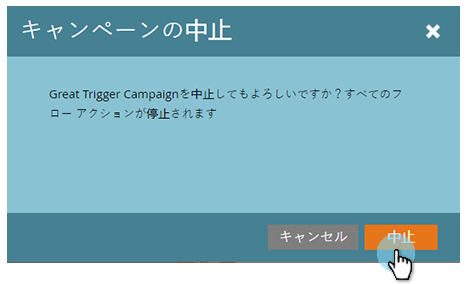

# スマートキャンペーンの中止 {#abort-a-smart-campaign}

>[!CAUTION]
>
>緊急時のみ

スマートキャンペーンを開始してすぐに、間違っていたことに気付く場合があります。実行途中でスマートキャンペーンを急停止する方法を説明します。

1. 目的のスマートキャンペーンを選択し、「**スケジュール**」タブをクリックします。

   

1. 「**キャンペーンのアクション**」ドロップダウンをクリックします。「**キャンペーンを中止**」を選択します。

   

1. 「**中止**」をクリックして確認します。

   

   >[!NOTE]
   >
   >中止しても、既に完了した手順が取り消されるわけではなく、それ以上の処理が停止されるだけです（例：メールの配信を取り消すことはできません）。

   

   >[!NOTE]
   >
   >中止する前に、実行されたアクションをスマートキャンペーンの「**結果**」タブで確認してください。また、追加の詳細と共に、[通知](/help/marketo/product-docs/core-marketo-concepts/miscellaneous/understanding-notifications.md)も確認できます。

   >[!TIP]
   >
   >トリガーキャンペーンのフローから人物を削除する場合は、[フローから削除](/help/marketo/product-docs/core-marketo-concepts/smart-campaigns/flow-actions/remove-from-flow.md)を参照してください。

操作のダブルチェックは欠かせませんが、この緊急ブレーキは将来役立つことがあるかもしれません。
