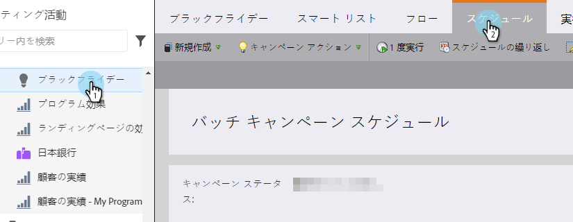
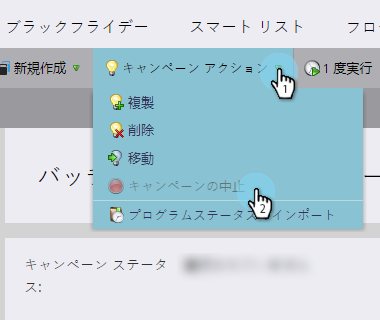
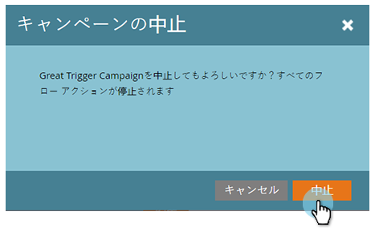
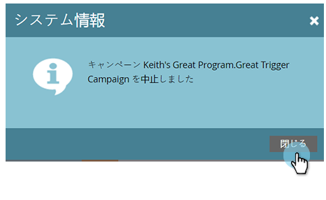

# スマートキャンペーンの中止 {#abort-a-smart-campaign}

>[!CAUTION]
>
>緊急時のみ

スマートキャンペーンを開始してすぐに、間違っていたことに気付く場合があります。 スマートキャンペーンのミッドランを停止するには、次の手順に従います。

1. 目的のスマートキャンペーンを選択し、「**[!UICONTROL スケジュール]**」タブをクリックします。

   

1. 「**[!UICONTROL キャンペーンのアクション]**」ドロップダウンをクリックします。 「**[!UICONTROL キャンペーンを中止]**」を選択します。

   

1. 「**[!UICONTROL 中止]**」をクリックして確認します。

   

   >[!NOTE]
   >
   >中断すると、既に完了したステップは取り消されず、より多くのステップが発生しなくなります（例：メールを配信停止できない）。

   

   >[!NOTE]
   >
   >中止する前に、実行されたアクションをスマートキャンペーンの「**[!UICONTROL 結果]**」タブで確認してください。 また、追加の詳細と共に、[通知](/help/marketo/product-docs/core-marketo-concepts/miscellaneous/understanding-notifications.md){target="_blank"}も確認できます。

   >[!TIP]
   >
   >トリガーキャンペーンのフローから人物を削除する場合は、 [フローから削除](/help/marketo/product-docs/core-marketo-concepts/smart-campaigns/flow-actions/remove-from-flow.md){target="_blank"}を参照してください。

仕事は必ず再確認しますが、この緊急ブレーキは役に立つかもしれません。
