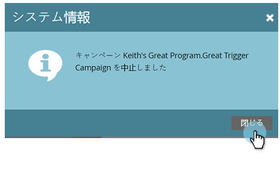

# スマートキャンペーンの中止 {#abort-a-smart-campaign}

>[!CAUTION]
>
>緊急時のみ

スマートキャンペーンを開始してすぐに、間違っていたことに気付く場合があります。実行途中でスマートキャンペーンを急停止する方法を説明します。

1. 目的のスマートキャンペーンを選択し、「**[!UICONTROL スケジュール]**」タブをクリックします。

   

1. 「**[!UICONTROL キャンペーンのアクション]**」ドロップダウンをクリックします。「**[!UICONTROL キャンペーンを中止]**」を選択します。

   

1. 「**[!UICONTROL 中止]**」をクリックして確認します。

   

   >[!NOTE]
   >
   >中止しても、既に完了した手順が取り消されるわけではなく、それ以上の処理が停止されるだけです（例：メールの配信を取り消すことはできません）。

   

   >[!NOTE]
   >
   >中止する前に、実行されたアクションをスマートキャンペーンの「**[!UICONTROL 結果]**」タブで確認してください。また、追加の詳細と共に、[通知](/help/marketo/product-docs/core-marketo-concepts/miscellaneous/understanding-notifications.md){target="_blank"}も確認できます。

   >[!TIP]
   >
   >トリガーキャンペーンのフローから人物を削除する場合は、[フローから削除](/help/marketo/product-docs/core-marketo-concepts/smart-campaigns/flow-actions/remove-from-flow.md){target="_blank"}を参照してください。

仕事の再確認をしなさい。でも、この非常ブレーキが役に立つかもしれません。
