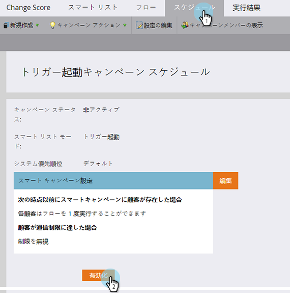
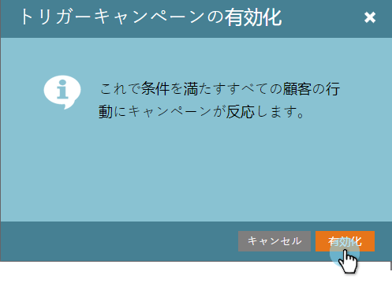

# トリガースマートキャンペーンのアクティブ化 | 「スケジュール」タブ {#activate-a-trigger-smart-campaign-schedule-tab}

トリガースマートキャンペーンの有効化は、有効にする場合と同じです。 その方法を説明します。

1. スマートキャンペーンの **スケジュール** タブ、クリック **有効化**.

   

   >[!TIP]
   >
   >有効化する前にスマートキャンペーンを確認してください。

1. 「**アクティブ化**」をもう一度クリックします。

   

   >[!CAUTION]
   >
   >有効化する前に、キャンペーンの準備が整っていることを確認してください。

今後、スマートリストの資格を満たすすべてのユーザーは、スマートキャンペーンで定義されたフローを通過します。
