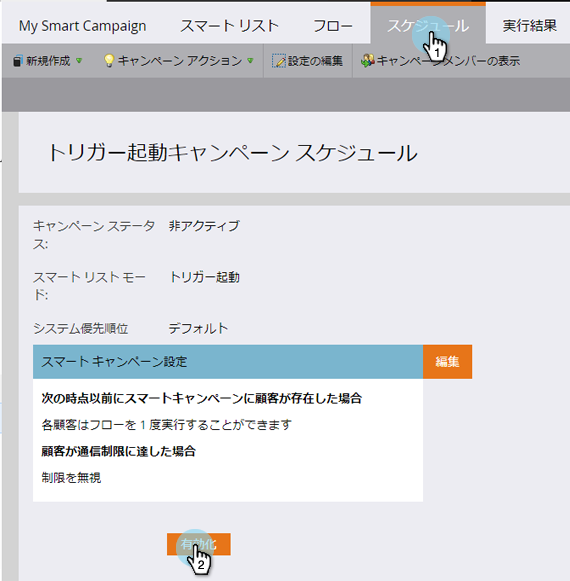
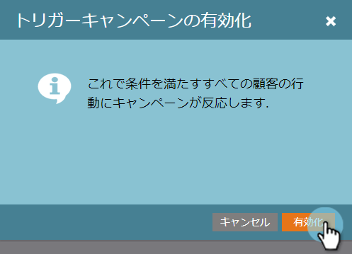

# トリガースマートキャンペーンのアクティブ化 |スケジュールタブ{#activate-a-trigger-smart-campaign-schedule-tab}

トリガースマートキャンペーンを有効にする操作は、オンにする操作と似ています。 どうすればいいか。

1. スマートキャンペーンの「**スケジュール**」タブで、「**アクティブ化**」をクリックします。

   

   >[!TIP]
   >
   >アクティブ化する前に、スマートキャンペーンを確認します。

1. 「****&#x200B;をアクティブ化」をもう一度クリックします。

   

   >[!CAUTION]
   >
   >「アクティブ化」をクリックする前に、キャンペーンの準備が整っていることを確認します。

今後は、スマートキャンペーンに該当するユーザーは誰でも、スマートリストが定義するフローを通ります。
