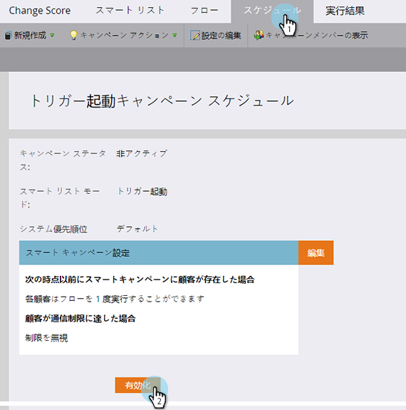
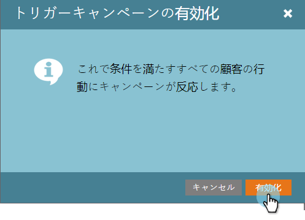

# トリガースマートキャンペーンのアクティブ化 | 「スケジュール」タブ {#activate-a-trigger-smart-campaign-schedule-tab}

トリガースマートキャンペーンのアクティブ化は、スマートキャンペーンをオンにすることと同じです。その方法を説明します。

1. スマートキャンペーンの「**[!UICONTROL スケジュール]**」タブで「**[!UICONTROL アクティブ化]**」をクリックします。

   

   >[!TIP]
   >
   >アクティブ化する前にスマートキャンペーンを確認します。

1. 「**[!UICONTROL アクティブ化]**」をもう一度クリックします。

   

   >[!TIP]
   >
   >アクティブ化する前に、キャンペーンの準備が整っていることを確認してください。

これ以降、スマートリストの資格を満たすすべての人物が、スマートキャンペーンで定義されたフローを通過することになります。
