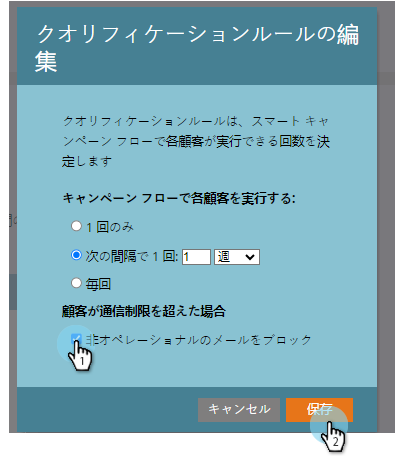

# スマートキャンペーンへの通信制限の適用 {#apply-communication-limits-to-smart-campaign}

>[!PREREQUISITES]
>
>[通信制限の有効化](/help/marketo/product-docs/administration/email-setup/enable-communication-limits.md)

1 日に何度もメールを送るのは良い考えではないし、1 週間に何度もメールを送るのは良い考えではないでしょう？ 幸いにも、Marketo Engageは、助ける通信制限を持っています。 ここでは、その仕組みについて説明します。

>[!NOTE]
>
>任意の人が設定された通信制限を超えると、Marketo は非オペレーショナルメールをブロックします（オペレーショナルメールは常に送信されます）。

1. スマートキャンペーンで、 **スケジュール** タブと **設定を編集**.

   

1. 「**非オペレーショナルメールをブロックする**」チェックボックスをオンにし、「**保存**」をクリックします。

   

>[!NOTE]
>
>制限は、スマートキャンペーンが影響を与える可能性のある認証済み担当者の数を指します。

>[!TIP]
>
>これをデフォルトにするには、「管理者」セクションの「[通信制限](/help/marketo/product-docs/administration/email-setup/enable-communication-limits.md)」をクリックします。

誤ってオーディエンスに大量のメールを送信しすぎないようにすることができます。
