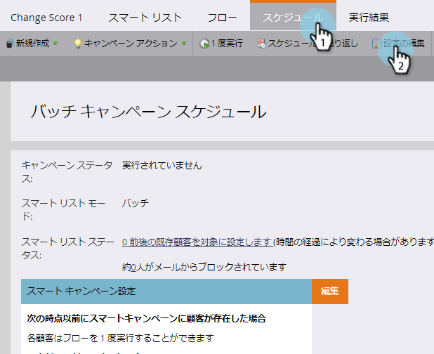
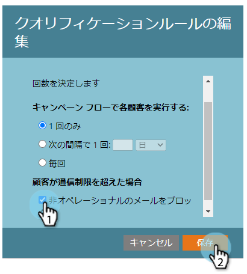

# スマートキャンペーンへの通信制限の適用 {#apply-communication-limits-to-smart-campaign}

>[!NOTE]
>
>**前提条件**
>
>* [通信制限を有効にする](../../../../product-docs/administration/email-setup/enable-communication-limits.md)

>

1日に何度もメールを送るのは良い考えではないし、1週間に何度もメールを送るのは良い考えではないでしょ？ 幸運なことに、Marketoにはコミュニケーションの限界があります。 これがその仕組みです

>[!NOTE]
>
>指定された通信制限を超える人がいる場合、Marketorは非操作電子メール（操作用電子メールが常に送信される）をブロックします。

1. スマートキャンペーンで、「スケジュール」タブをクリックし、「設定の編集」をクリックします。

1. [非操作電子メールをブロックする]チェックボックスをオンにし、[保存]をクリックします。

   

>[!NOTE]
>
>制限とは、スマートキャンペーンが影響を与える資格のある人の数を指します。

>[!TIP]
>
>これをデフォルトにするには、「管理者 [」セクションで](../../../../product-docs/administration/email-setup/enable-communication-limits.md) 通信制限を編集します。

甘い。 誤ってオーディエンスに送信する電子メールの数が多くなりすぎないように保証できます。