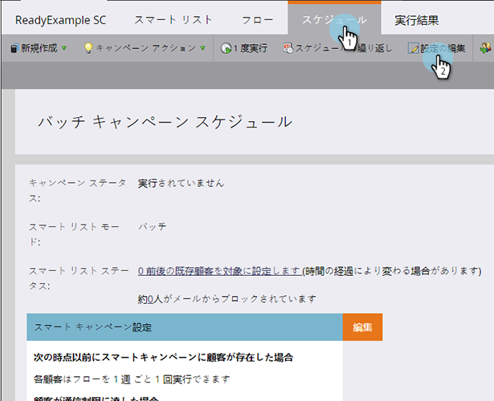
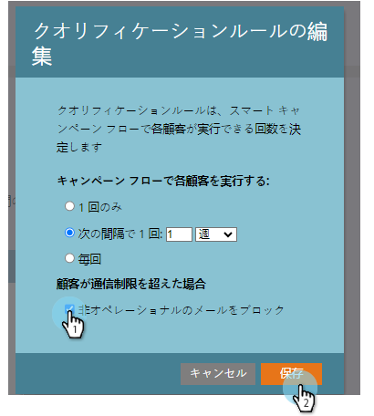

# スマートキャンペーンへの通信制限の適用 {#apply-communication-limits-to-smart-campaign}

>[!PREREQUISITES]
>
>[通信制限の有効化](/help/marketo/product-docs/administration/email-setup/enable-communication-limits.md){target="_blank"}

誰かに1日に何度もメールを送ったり、1週間に何度もメールを送ったりするのは良い考えではありません？ 幸いなことに、Marketo Engageにはコミュニケーションの限界があります。

>[!NOTE]
>
>任意の人が設定された通信制限を超えると、Marketo は非オペレーショナルメールをブロックします（オペレーショナルメールは常に送信されます）。

1. スマートキャンペーンで、「**[!UICONTROL スケジュール]**」タブをクリックし、「**[!UICONTROL 設定を編集]**」をクリックします。

   

1. 「**[!UICONTROL 非オペレーショナルメールをブロック]**」チェックボックスをオンにし、「**[!UICONTROL 保存]**」をクリックします。

   

>[!NOTE]
>
>制限は、条件を満たす人物のうち、スマートキャンペーンが影響を及ぼす可能性のある人数を示します。

>[!TIP]
>
>これをデフォルトにするには、「管理者」セクションで[通信制限](/help/marketo/product-docs/administration/email-setup/enable-communication-limits.md){target="_blank"}を編集します。

オーディエンスに誤って多くのメールを送信していないことを確認できます。
