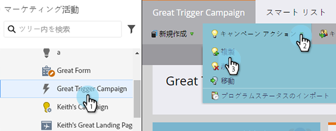
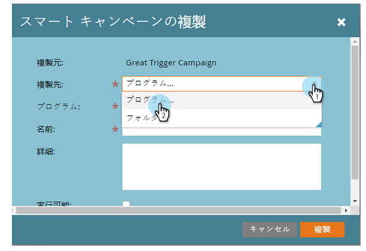
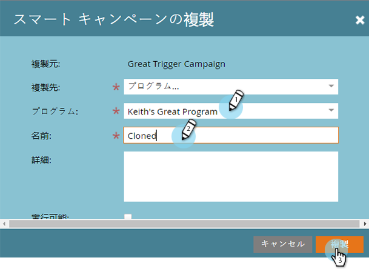

# キャンペーンのアクション：スマートキャンペーンの複製を作成 {#campaign-actions-clone-a-smart-campaign}

キャンペーンを複製すると、すべてをゼロから作成する必要がなくなり、時間を節約できます。複製は、全く同じスマートリストフィルターとフローステップを持つ、同一のキャンペーンを作成します。

1. 複製するキャンペーンを選択します。 内 **キャンペーンアクション** ドロップダウンで、「 **複製**.

   

1. 「**複製先**」で適切なオプションを選択します。この例では、「**プログラム**」を選択しています。

   

1. 「**プログラム**」を選択します。「**キャンペーン名**」を入力し、「**複製**」をクリックします。

   

完成です。
