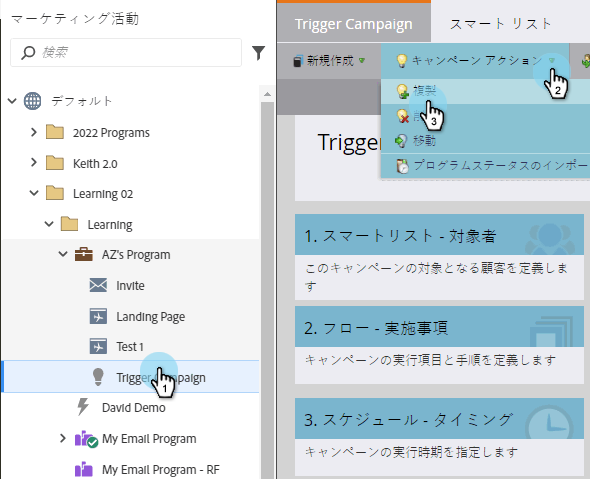
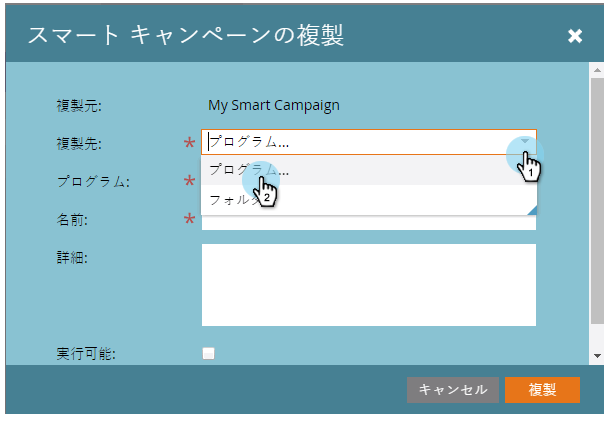
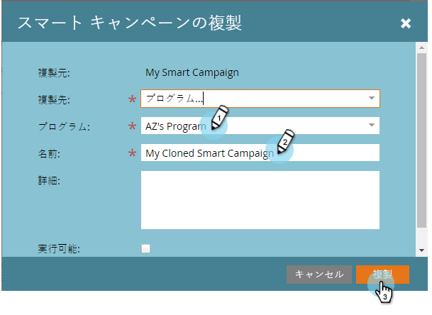

# キャンペーンの操作：スマートキャンペーンのコピー {#campaign-actions-clone-a-smart-campaign}

キャンペーンを複製すると時間を節約できます。 すべてをゼロから構築する必要はありません。クローン作成により、スマートリストのフィルターとフロー・ステップが完全に同じで、同一のキャンペーンが作成されます。

1. コピーするキャンペーンを見つけて選択し、[ **キャンペーン操作** ]の下にある[ **コピー**]をクリックします。

   

1. 「**コピー先**」オプションを選択します。 この例では、 **プログラムを選択します**。

   

1. **プログラムを選択します**。 「 **キャンペーン名** 」に名前を入力し、「 **クローン**」をクリックします。

   

   終わった！ 頑張るな、頭よく働け。

