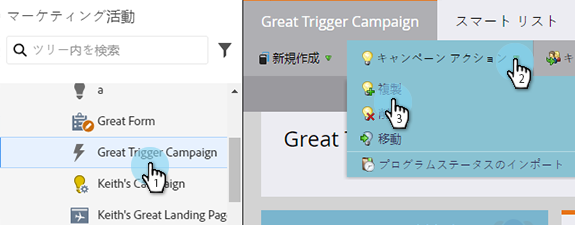
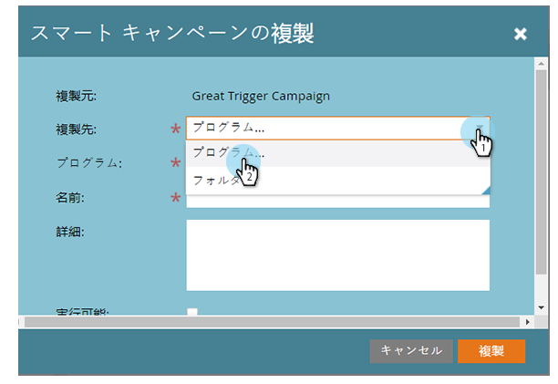
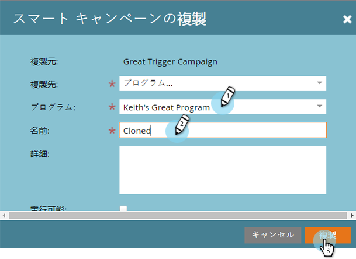

# キャンペーンのアクション：スマートキャンペーンの複製を作成 {#campaign-actions-clone-a-smart-campaign}

キャンペーンを複製すると、 すべてをゼロから作成する必要がなくなり、時間を節約できます。複製は、全く同じスマートリストフィルターとフローステップを持つ、同一のキャンペーンを作成します。

1. 複製するキャンペーンを選択します。 「**[!UICONTROL キャンペーンアクション]**」ドロップダウンで、「**[!UICONTROL 複製]**」を選択します。

   

1. 「**[!UICONTROL 複製先]**」で適切なオプションを選択します。 この例では、「**[!UICONTROL プログラム]**」を選択しています。

   

1. 「**[!UICONTROL プログラム]**」を選択します。 「**[!UICONTROL キャンペーン名]**」を入力し、「**[!UICONTROL 複製]**」をクリックします。

   
