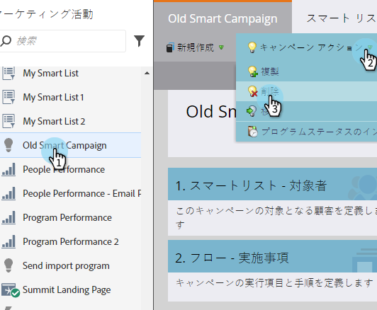
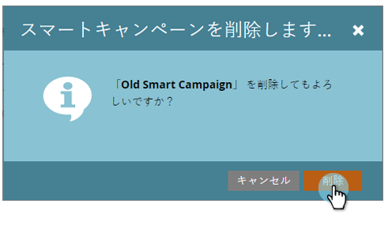

# キャンペーンの操作：スマートキャンペーンの削除{#campaign-actions-delete-a-smart-campaign}

不要になった古いスマートキャンペーンがある場合は、削除できます。 これが方法です。

>[!CAUTION]
>
>削除する前に必ず確認してください。 スマートキャンペーンを削除すると、復元できません。

1. **マーケティングアクティビティ**&#x200B;エリアに移動します。

   

1. 非アクティブなスマートキャンペーンに移動します。 **キャンペーン** **アクション**&#x200B;の下の&#x200B;**削除**&#x200B;をクリックします。

   >[!TIP]
   >
   >アクティブなスマートキャンペーンの処理を完全に削除せずにキャンセルするには、スマートキャンペーン](abort-a-smart-campaign.md)を[中止する方法を学びます。

   

1. 「**削除**」をクリックして確認します。

   

   >[!CAUTION]
   >
   >フローステップのユーザーとのアクティブなスマートキャンペーンを&#x200B;**NOT**&#x200B;削除してください。 キャンペーンは、引き続き実行される可能性があります。

ナイス！