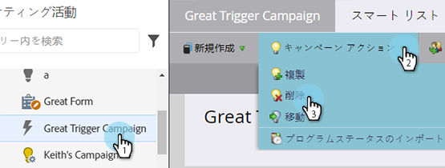
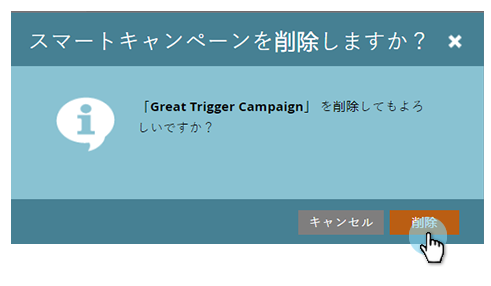

# キャンペーンのアクション：スマートキャンペーンの削除 {#campaign-actions-delete-a-smart-campaign}

不要になった古いスマートキャンペーンがある場合は、削除できます。

>[!CAUTION]
>
>削除する前に必ず確認してください。 スマートキャンペーンを削除すると、復元できません。

1. 「**[!UICONTROL マーケティング活動]**」領域に移動します。

   

1. 非アクティブなスマートキャンペーンに移動します。 **[!UICONTROL キャンペーンアクション]** ドロップダウンで、**[!UICONTROL 削除]**&#x200B;を選択します。

   

   >[!TIP]
   >
   >アクティブなスマートキャンペーンを完全に削除せずに処理をキャンセルするには、[ スマートキャンペーンを中止する方法](/help/marketo/product-docs/core-marketo-concepts/smart-campaigns/using-smart-campaigns/abort-a-smart-campaign.md)を説明します。

1. 「**[!UICONTROL 削除]**」をクリックして確定します。

   

   >[!CAUTION]
   >
   >フローステップのユーザーを含むアクティブなスマートキャンペーンは削除しないでください。 キャンペーンは、まだ実行される可能性があります。
