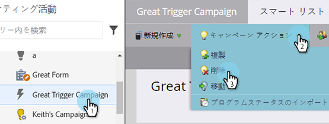
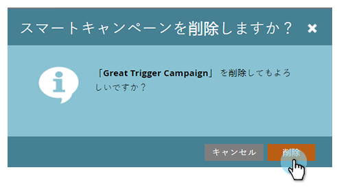

# キャンペーンのアクション：スマートキャンペーンの削除 {#campaign-actions-delete-a-smart-campaign}

不要になった古いスマートキャンペーンがある場合は、そのスマートキャンペーンを削除できます。 手順は以下のとおりです。

>[!CAUTION]
>
>削除する前に必ず確認してください。スマートキャンペーンを削除すると、復元できなくなります。

1. **[!UICONTROL マーケティングアクティビティ]**&#x200B;領域に移動します。

   

1. 非アクティブなスマートキャンペーンに移動します。 「**[!UICONTROL キャンペーンアクション]**」ドロップダウンで、「**[!UICONTROL 削除]**」を選択します。

   

   >[!TIP]
   >
   >アクティブなスマートキャンペーンを完全に削除せずにキャンセルするには、以下の手順を実行します。 [スマートキャンペーンの中止](/help/marketo/product-docs/core-marketo-concepts/smart-campaigns/using-smart-campaigns/abort-a-smart-campaign.md).

1. 「**[!UICONTROL 削除]**」をクリックして確定します。

   

   >[!CAUTION]
   >
   >フローステップの担当者を含むアクティブなスマートキャンペーンを削除しないでください。 キャンペーンは、まだ実行される可能性があります。
