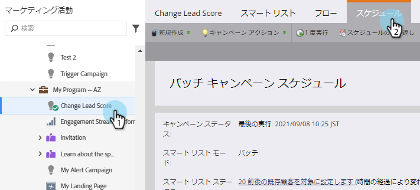
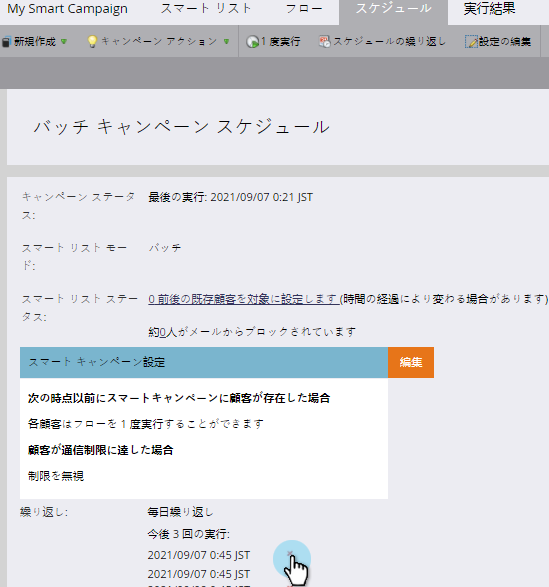
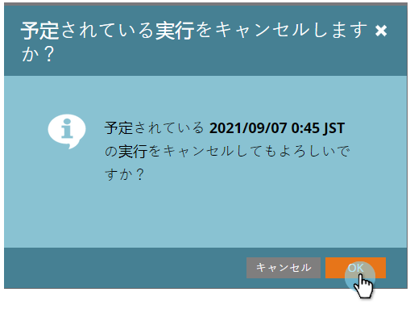

# スケジュールされたバッチキャンペーンの実行{#cancel-a-scheduled-batch-campaign-run}をキャンセル

バッチキャンペーンの1つに対して実行をスケジュール済みで、それをキャンセルする場合は、次のようにします。

1. キャンペーンを選択し、「スケジュール」タブに移動します。

   

1. キャンセルするスケジュール済みの実行を見つけ、その横のxをクリックします。

   

1. 「OK」をクリックしてキャンセルを確認します。

   

>[!NOTE]
>
>実行が既に開始されている場合、この操作は役に立ちません。 これは、今後の実行をキャンセルする必要があると判断した場合に使用します。

ナイス！