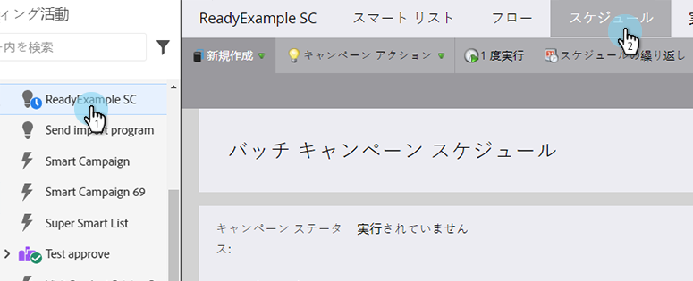
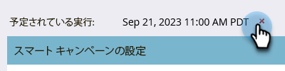
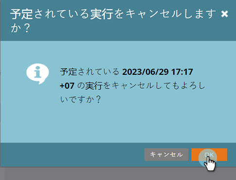

# 予定されているバッチキャンペーンの実行のキャンセル {#cancel-a-scheduled-batch-campaign-run}

バッチキャンペーンを実行するようにスケジュールが設定されてあり、その実行をキャンセルする場合は、以下の手順を実行します。

1. 目的のキャンペーンを選択して「**スケジュール**」タブに移動します。

   

1. キャンセルする予定されている実行を見つけ、 **x** 隣に

   

1. 「**OK**」をクリックして、キャンセルを確認します。

   

>[!NOTE]
>
>キャンペーンの実行が既に開始されている場合は、この操作ではキャンセルされません。この操作は、将来の実行をキャンセルするときに使用します。
