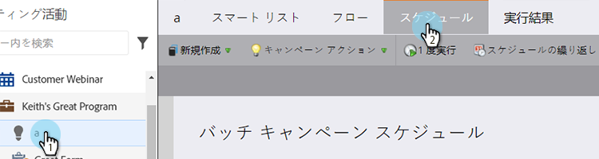
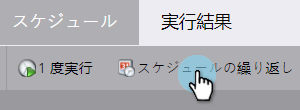
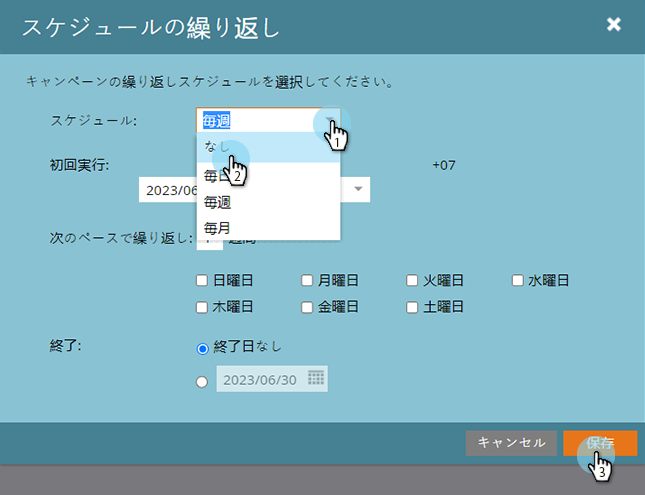

# 繰り返し予定されているバッチキャンペーンの実行のキャンセル {#cancel-a-scheduled-recurring-batch-campaign-run}

不要な繰り返しバッチキャンペーンがある場合は、以降の実行をキャンセルできます。ここでは、その方法を説明します。

1. スマートキャンペーンを選択し、「**スケジュール**」タブをクリックします。

   

1. 「**繰り返しのスケジュール**」をクリックします。

   

   >[!TIP]
   >
   >横の赤い「」をクリックして、1 回の実行をキャンセルできます。[予定されているバッチキャンペーンの実行をキャンセル](/help/marketo/product-docs/core-marketo-concepts/smart-campaigns/using-smart-campaigns/cancel-a-scheduled-batch-campaign-run.md)する方法を説明します。

1. 「スケジュール」を「**なし**」に設定してから、「**保存**」をクリックします。

   

   これで完成です。スマートキャンペーンは実行されなくなります。

   >[!CAUTION]
   >
   >これにより、以降の実行がキャンセルされますが、スマートキャンペーンの実行中はキャンセルできません。

   >[!MORELIKETHIS]
   >
   >[予定されているバッチキャンペーンの実行のキャンセル](/help/marketo/product-docs/core-marketo-concepts/smart-campaigns/using-smart-campaigns/cancel-a-scheduled-batch-campaign-run.md)
