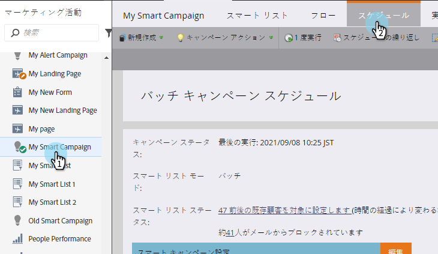
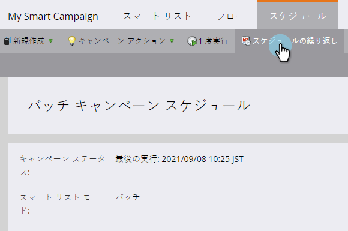

# 定期バッチキャンペーンの実行のキャンセル{#cancel-a-scheduled-recurring-batch-campaign-run}

これ以上必要のない定期バッチキャンペーンがある場合は、今後の実行をキャンセルできます。 これが方法です。

1. スマートキャンペーンをクリックし、「**スケジュール**」タブをクリックします。

   

1. [**繰り返しのスケジュール**]をクリックします。

   

   >[!TIP]
   >
   >横のをクリックすると、1回の実行をキャンセルできます。 スケジュールされたバッチキャンペーンを[キャンセルする方法](/help/marketo/product-docs/core-marketo-concepts/smart-campaigns/using-smart-campaigns/cancel-a-scheduled-batch-campaign-run.md)を説明します。

1. スケジュールを&#x200B;**なし**&#x200B;に設定し、次に&#x200B;**保存**&#x200B;に設定します。

   

   よし！ スマートキャンペーンは、もう実行されません。

   >[!CAUTION]
   >
   >これにより、今後の実行がキャンセルされますが、スマートキャンペーンが実行中の場合はキャンセルできません。

   >[!MORELIKETHIS]
   >
   >[スケジュール済バッチキャンペーンの実行の取り消し](/help/marketo/product-docs/core-marketo-concepts/smart-campaigns/using-smart-campaigns/cancel-a-scheduled-batch-campaign-run.md)
