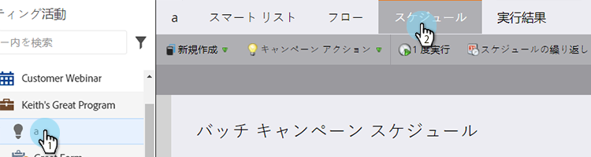
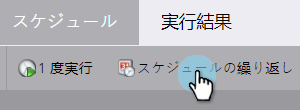
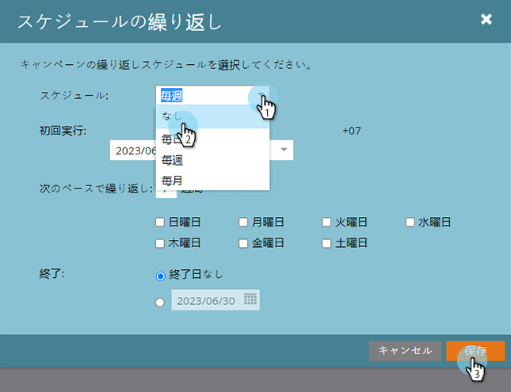

# 繰り返し予定されているバッチキャンペーンの実行のキャンセル {#cancel-a-scheduled-recurring-batch-campaign-run}

不要になった定期的なバッチキャンペーンがある場合は、今後の実行をキャンセルできます。

1. 「スマートキャンペーン」を選択し、「**スケジュール**」タブをクリックします。

   

1. 「**[!UICONTROL 繰り返しのスケジュール]**」をクリックします。

   

   >[!TIP]
   >
   >横の赤い「」をクリックして、1 回の実行をキャンセルできます。 [予定されているバッチキャンペーンの実行をキャンセル](/help/marketo/product-docs/core-marketo-concepts/smart-campaigns/using-smart-campaigns/cancel-a-scheduled-batch-campaign-run.md){target="_blank"}する方法を説明します。

1. 「スケジュール」を「**[!UICONTROL なし]**」に設定してから、「**[!UICONTROL 保存]**」をクリックします。

   

   これで完成です。 スマートキャンペーンは実行されなくなります。

   >[!CAUTION]
   >
   >これにより、以降の実行がキャンセルされますが、スマートキャンペーンが処理中の場合はキャンセルできません。

   >[!MORELIKETHIS]
   >
   >[予定されているバッチキャンペーンの実行のキャンセル](/help/marketo/product-docs/core-marketo-concepts/smart-campaigns/using-smart-campaigns/cancel-a-scheduled-batch-campaign-run.md){target="_blank"}
