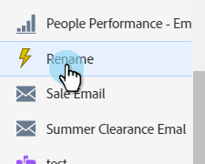
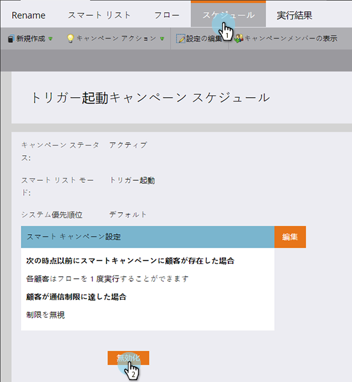
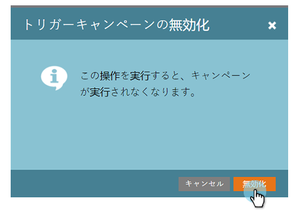

# トリガースマートキャンペーンの無効化 | 「スケジュール」タブ {#deactivate-a-trigger-smart-campaign-schedule-tab}

過去のトリガーキャンペーンを無効化する必要がある場合は、以下の手順に従います。

1. 無効化するトリガーキャンペーンを探して選択します。

   

1. 「スケジュール」タブで「**無効化**」をクリックします。

   

1. 「**無効化**」をクリックして確認します。

   

>[!NOTE]
>
>この操作により、*新しい*&#x200B;リードがフローに送られなくなりますが、リードが待機ステップ、またはその他のいずれかのフローステップにいる場合は、フローが完了するまで処理が続行されます。
