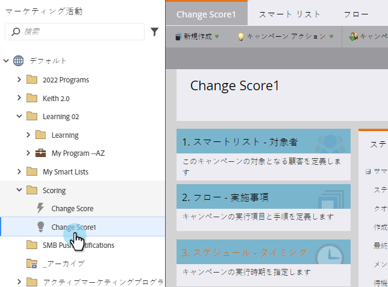
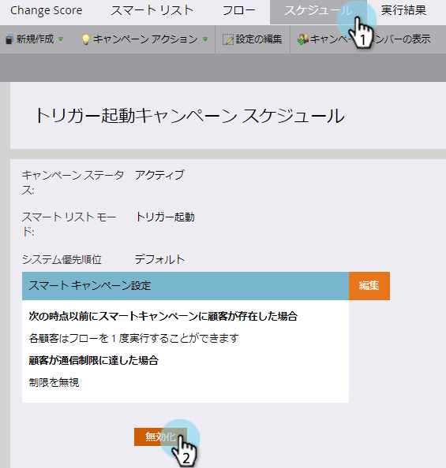
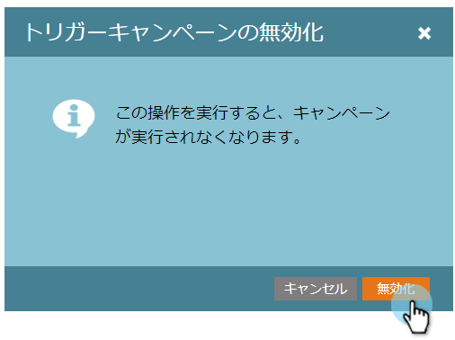

# トリガースマートキャンペーンの非アクティブ化 |スケジュールタブ{#deactivate-a-trigger-smart-campaign-schedule-tab}

非アクティブ化する必要がある古いトリガーキャンペーンがある場合は、次の手順に従います。

1. アクティブなトリガーキャンペーンを探して選択します。

   

1. 「スケジュール」タブで、「非アクティブ化」をクリックします。

   

1. 「非アクティブ化」をクリックして、確認します。

   

>[!NOTE]
>
>これにより、*新しい*&#x200B;人がフローに入るのを止めますが、待機ステップや他のフローステップの人々は、完了するまでフローを通り続けます。

