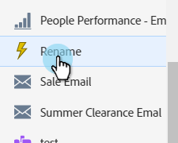
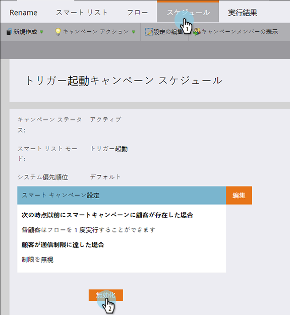
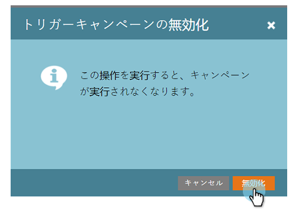

# トリガースマートキャンペーンの無効化 | 「スケジュール」タブ {#deactivate-a-trigger-smart-campaign-schedule-tab}

非アクティブ化する必要がある古いトリガーキャンペーンがある場合は、次の手順に従います。

1. アクティブなトリガーキャンペーンを検索して選択します。

   

1. 「スケジュール」タブで「**[!UICONTROL 無効化]**」をクリックします。

   

1. 「**[!UICONTROL 無効化]**」をクリックして確認します。

   

>[!NOTE]
>
>この操作により、_新しい_&#x200B;リードがフローに送られなくなりますが、リードが待機ステップ、またはその他のいずれかのフローステップにいる場合は、フローが完了するまで処理が続行されます。
