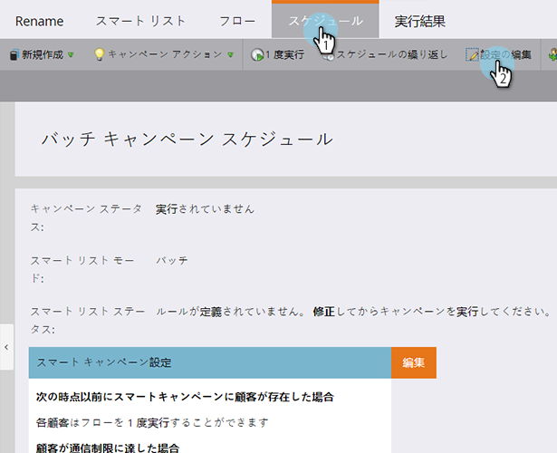
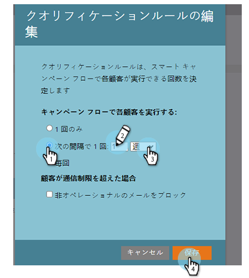

# スマートキャンペーンでのクオリフィケーションルールの編集 {#edit-qualification-rules-in-a-smart-campaign}

クオリフィケーションルールは、スマートキャンペーンのフローでユーザーが実行できる回数を制御します。デフォルトでは、スマートキャンペーンを複数回トリガーした場合でも、フローを介して送信されるのは 1 回のみです。これらの設定の変更方法を次に示します。

1. スマートキャンペーンで、「**スケジュール**」タブをクリックし、「**設定を編集**」をクリックします。

   

   >[!TIP]
   >
   >また、「スマートキャンペーン設定」の右にある「**編集**」をクリックすることもできます。

1. スマートキャンペーンフローで各人物が実行できる回数を次から選択します。**1 回のみ**、**毎回**、または&#x200B;**次の間隔で 1 回：日付**／**週**／**月**

   

   >[!NOTE]
   >
   >ルールを毎日 1 回に設定すると、Marketo はそのルールを時間に変換します。例えば、ルールを 1 日に 1 回に設定し、日曜日の夜の午後 10 時に人物が条件を満たした場合、月曜日の夜の午後 10 時まで再度条件を満たすことはできません。このロジックは、週や月を使用する場合にも適用されます。1 か月は常に 30 日とカウントされます。

   >[!NOTE]
   >
   >スマートキャンペーンには、デフォルトで通信制限が適用されません。[スマートキャンペーンへの通信制限の適用](/help/marketo/product-docs/core-marketo-concepts/smart-campaigns/using-smart-campaigns/apply-communication-limits-to-smart-campaign.md)を参照してください。

   >[!NOTE]
   >
   >[スマートキャンペーンへの通信制限の適用](/help/marketo/product-docs/core-marketo-concepts/smart-campaigns/using-smart-campaigns/apply-communication-limits-to-smart-campaign.md)

ミッション完了です。スマートキャンペーンでクオリフィケーションルールを制御する方法を理解できました。
