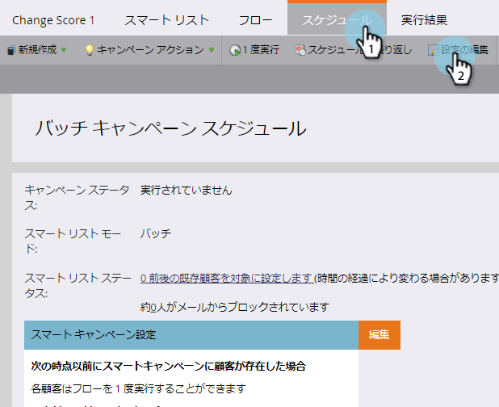
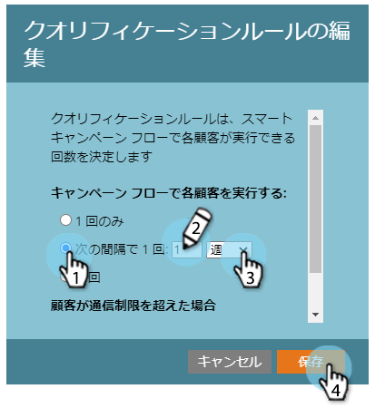

# スマートキャンペーンでの資格ルールの編集 {#edit-qualification-rules-in-a-smart-campaign}

資格ルールは、スマートキャンペーン内のフローを何回実行できるかを制御します。 デフォルトでは、スマートキャンペーンを複数回トリガーした場合でも、フローを1回送信するだけです。 これらの設定を変更する方法を次に示します。

>[!NOTE]
>
>**FYI**
>
>Marketoは現在、すべての購読で言語を標準化しているので、購読およびdocs.marketo.comの人物/人物にリード/リードを表示できます。 これらの用語は同じことを意味し、記事の説明には影響しません。 他にも変化がある。 [詳細情報](http://docs.marketo.com/display/DOCS/Updates+to+Marketo+Terminology)。

1. スマートキャンペーンで、「 **スケジュール** 」タブをクリックし、「設定の **編集**」をクリックします。

   

   >[!TIP]
   >
   >「スマートキャンペーン設定」の右にある **編集** (Edit)をクリックすることもできます。

1. スマートキャンペーンの流れを通じて人を実行する頻度を選択します。 **1回**、 **毎回**、または **1回、#日**/**数週間**/noths **noths**.

   

   >[!NOTE]
   >
   >ルールを毎日1回設定すると、Marketorはそれを時間に変換します。 例えば、1日1回のルールを設定し、ある人が日曜日の夜の10時の資格を得た場合、月曜日の夜の10時まで再び資格を得ることはできません。 このロジックは、週または月を使用する場合にも適用されます。 1か月は常に30日とカウントされます。

   >[!NOTE]
   >
   >**Reminder**
   >
   >
   >通信の制限は、デフォルトではスマートキャンペーンに適用されません。 スマートキャンペーンに通信制限を [適用する方法を説明します](apply-communication-limits-to-smart-campaign.md)。

   >[!NOTE]
   >
   >**関連記事**
   >
   >    
   >    
   >    * [スマート・キャンペーンへの通信制限の適用](apply-communication-limits-to-smart-campaign.md)

任務完了！ これで、スマートキャンペーンで資格ルールを制御する方法を理解できました。