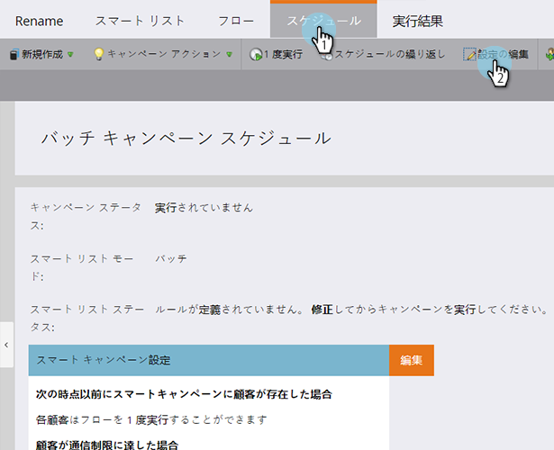
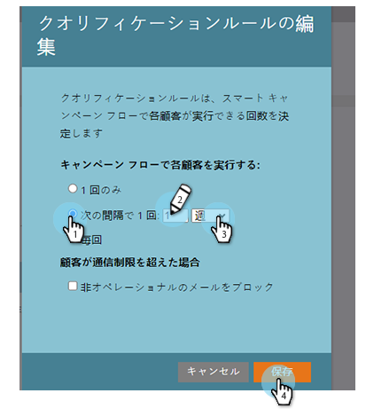

# スマートキャンペーンでの選定ルールの編集 {#edit-qualification-rules-in-a-smart-campaign}

クオリフィケーションルールは、スマートキャンペーンでフローを実行できる回数を制御します。 デフォルトでは、誰かがスマートキャンペーンを複数回トリガーした場合でも、フローを通じてのみ送信されます。

1. スマートキャンペーンで、「**[!UICONTROL スケジュール]**」タブをクリックし、「**[!UICONTROL 設定を編集]**」をクリックします。

   

   >[!TIP]
   >
   >また、「スマートキャンペーン設定」の右にある「**[!UICONTROL 編集]**」をクリックすることもできます。

1. スマートキャンペーンのフローを実行する頻度を選択します：**[!UICONTROL 1回のみ]**、**[!UICONTROL 回]**、または&#x200B;**回#日**/**週**/**か月**。

   

   >[!NOTE]
   >
   >* ルールを毎日 1 回に設定すると、Marketo はそのルールを時間に変換します。 例えば、ルールを 1 日に 1 回に設定し、日曜日の夜の午後 10 時に人物が条件を満たした場合、月曜日の夜の午後 10 時まで再度条件を満たすことはできません。 このロジックは、週や月を使用する場合にも適用されます。 1 か月は常に 30 日とカウントされます。
   >
   >* 通信制限は、デフォルトではスマートキャンペーンには適用されません。 スマートキャンペーンに通信制限を[適用する方法について説明します](/help/marketo/product-docs/core-marketo-concepts/smart-campaigns/using-smart-campaigns/apply-communication-limits-to-smart-campaign.md){target="_blank"}。
