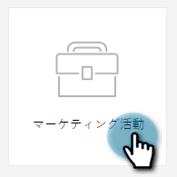

# スマートキャンペーンの移動 {#move-a-smart-campaign}

ツリーのドラッグ＆ドロップまたは移動機能を使用して、様々なプログラムやフォルダー間でスマートキャンペーンを移動します。スマートキャンペーンのルールは変更されず、別の場所にネストされるだけです。

1. **マーケティングアクティビティ**&#x200B;に移動します。

   

1. 移動するスマートキャンペーンを見つけ、右クリックして「**移動**」を選択します。

   

1. **宛先**（宛先）、**プログラム**、およびオプションの&#x200B;**フォルダー**&#x200B;を選択します。 「**移動**」を選択します。

   

   >[!NOTE]
   >
   >この例では、スマートキャンペーンを別のプログラムに移動しますが、キャンペーンフォルダーに移動することもできます。

お疲れ様です。スマートキャンペーンが移動されました。

