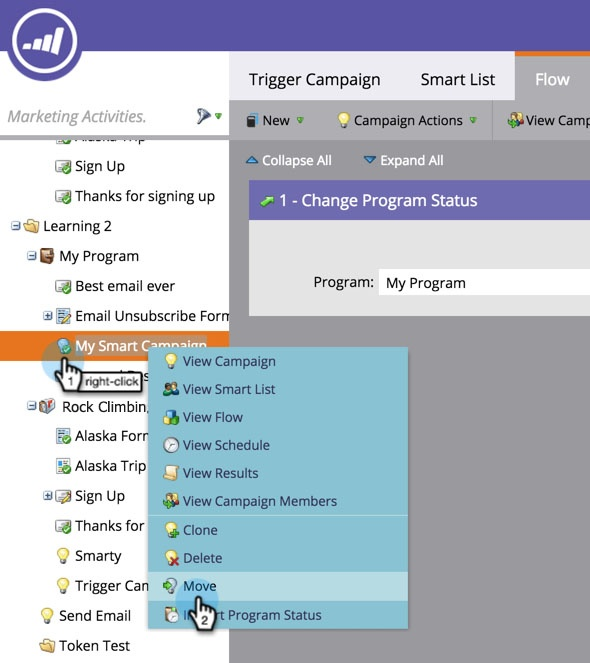

# スマートキャンペーンの移動 {#move-a-smart-campaign}

ツリーのドラッグ＆ドロップまたは移動機能を使用して、様々なプログラムやフォルダー間でスマートキャンペーンを移動します。

## ドラッグ＆ドロップを使用 {#use-drag-and-drop}

1. 「**マーケティングアクティビティ**」エリアに移動します。

   

1. スマートキャンペーンを選択し、新しいプログラムにドラッグ＆ドロップします。

   

   これで完了です。選択したスマートキャンペーンが、新しいプログラムに入りました。フォルダーの場合でも同じことが行えます。

   >[!NOTE]
   >
   >スマートキャンペーンのルールは変更されず、別の場所にネストされるだけです。

## 移動機能を使用 {#use-the-move-feature}

スマートキャンペーンは、ツリーの移動機能を使用して移動することもできます。

1. スマートキャンペーンを右クリックします。「**移動**」を選択します。

   

1. **プログラム**&#x200B;または&#x200B;**フォルダー**&#x200B;に移動するかを選択します。

   

1. スマートキャンペーンの具体的な移動先を選択します。

   

1. 「**移動**」をクリックします。

   

   これで完了です。スマートキャンペーンは移動されました。

   
