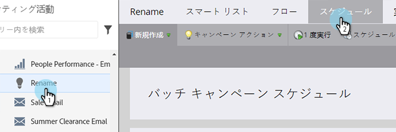
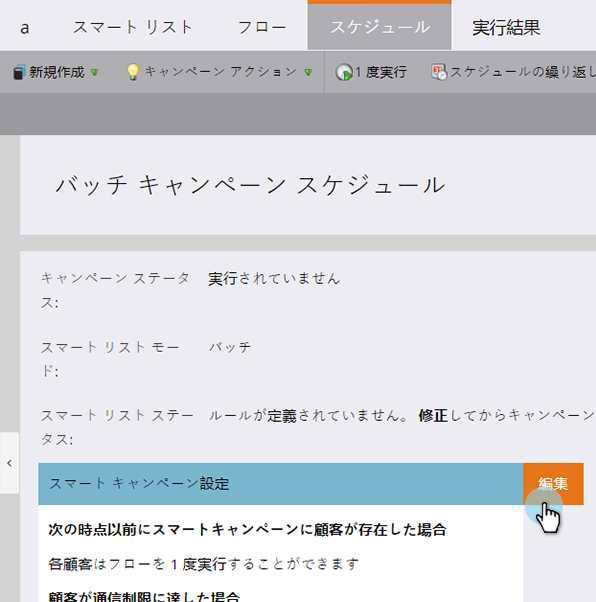
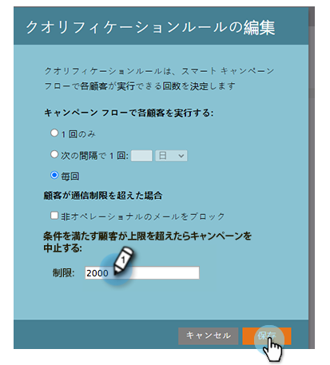

# スマートキャンペーンでのリード制限数の上書き {#override-person-restrictions-in-a-smart-campaign}

Marketo では、スマートキャンペーンに振り分けられる最大リード数を設定できます。これにより、データベース全体に誤ってメールを送信するのを防ぐことができます。この制限を&#x200B;_上書き_&#x200B;する場合は、次の手順に従います。

>[!PREREQUISITES]
>
>Marketo 管理で、[スマートキャンペーンに対するリード制限を有効](/help/marketo/product-docs/administration/email-setup/enable-person-restrictions-for-smart-campaigns.md)にします。

1. 「マーケティング活動」で、スマートキャンペーンに移動し、「**スケジュール**」をクリックします。

   

1. スマートキャンペーン設定で、「**編集**」をクリックします。

   

   >[!NOTE]
   >
   >デフォルトの制限は、管理で設定された制限です。

1. 新しい制限を入力し、「**保存**」をクリックします。

   

   適合するリード数が設定された制限を超えると、スマートキャンペーンは実行されません。

   >[!CAUTION]
   >
   >誤って多くのリードを含めすぎないように、この機能を活用してください。
