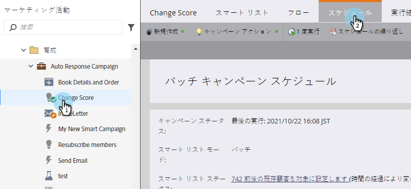
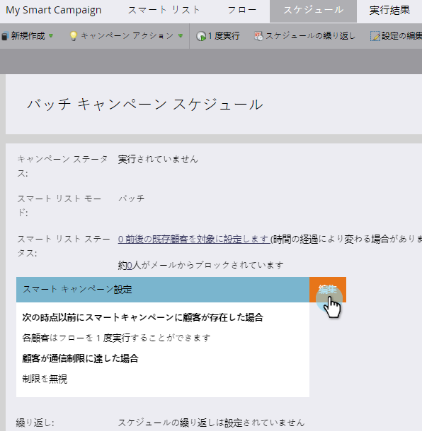

# スマートキャンペーンの個人制限の上書き {#override-person-restrictions-in-a-smart-campaign}

Marketorでは、スマートキャンペーンに振り分けられる人の最大数* *を設定できます。これにより、データベース全体を誤って電子メールで送信するのを防ぐことができます。 この制限を *上書きする場合は* 、次のようにします。

>[!PREREQUISITES]
>
>必ず、Marketor管理者でスマートキャンペーンに対する個人制限を [有効にしてください](../../../../product-docs/administration/email-setup/enable-person-restrictions-for-smart-campaigns.md) 。

1. マーケティングアクティビティで、** **smartキャンペーンに移動し、「 **スケジュール**」をクリックします。

   

   「スマートキャンペーン設定」で、「編集」をクリックします。
   

   >[!NOTE]
   >
   >デフォルトの制限は、管理で設定された制限です。

1. 新しい制限を入力し、「 **保存」をクリックします。**

   

   資格を得た人の数が設定された制限を超えると、スマートキャンペーンは実行されません。

   >[!CAUTION]
   >
   >誤って多くの人が含まれないように、この機能に注意してください。

