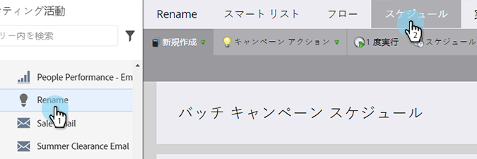
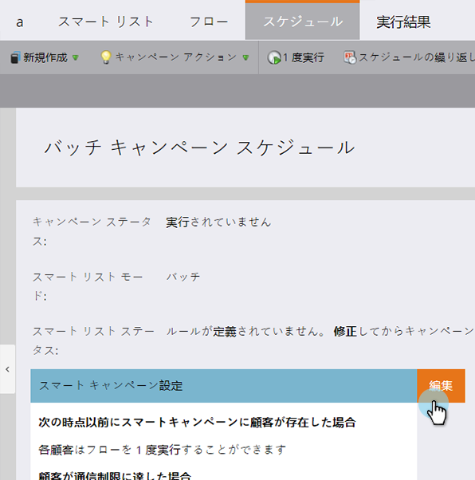
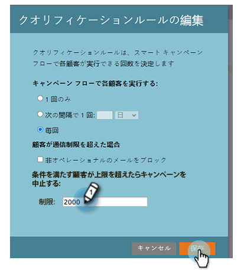

# スマートキャンペーンでのリード制限数の上書き {#override-person-restrictions-in-a-smart-campaign}

Marketo Engageでは、スマートキャンペーンの対象となる最大人数を設定できます。これにより、データベース全体に誤ってメールを送信するのを防ぐことができます。 この制限を&#x200B;_上書き_&#x200B;する場合は、次の手順に従います。

>[!PREREQUISITES]
>
>Marketo Adminで[&#x200B; スマートキャンペーンのユーザー制限を有効にする](/help/marketo/product-docs/administration/email-setup/enable-person-restrictions-for-smart-campaigns.md){target="_blank"}必要があります。

1. **[!UICONTROL マーケティングアクティビティ]**&#x200B;で、スマートキャンペーンに移動し、**[!UICONTROL スケジュール]**&#x200B;をクリックします。

   

1. スマートキャンペーン設定で、「**[!UICONTROL 編集]**」をクリックします。

   

   >[!NOTE]
   >
   >デフォルトの制限は、管理で設定された制限です。

1. 新しい制限を入力し、**[!UICONTROL 保存]**&#x200B;をクリックします。

   

   条件を満たす人数が設定された制限を超えた場合、スマートキャンペーンは実行されません。

   >[!CAUTION]
   >
   >誤って多くの人を含めないように、この機能に注意してください。
