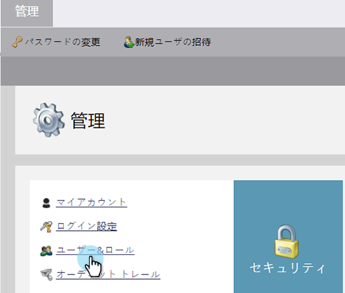
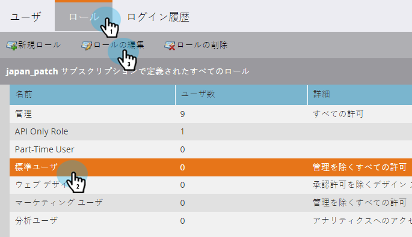
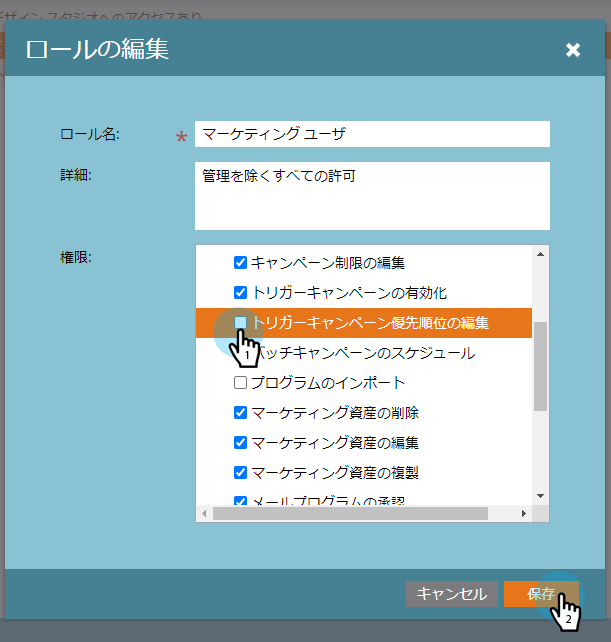
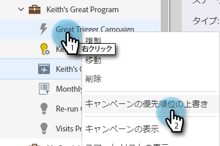
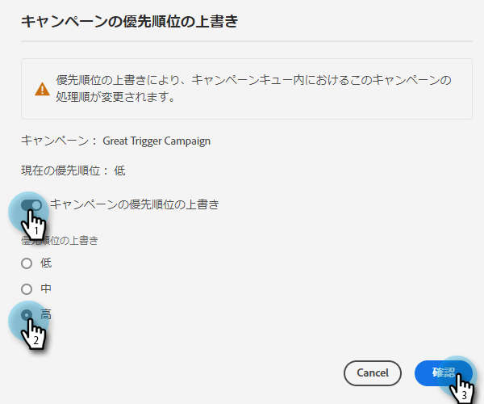
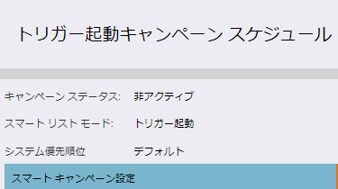

# トリガーキャンペーンの優先度の上書き {#priority-override-for-trigger-campaigns}

管理者は、Marketoが決定した優先度を上書きして、トリガー目標に合わせた優先度を設定できます。

>[!NOTE]
>
>この機能は、トリガーキャンペーンと、 [「トリガーキャンペーンの優先順位の編集」権限](#grant-priority-override-access).

>[!CAUTION]
>
>この機能は、限られたビジネスクリティカルなキャンペーンのセットで使用することを強くお勧めします（最大 25 が推奨されます）。 大きなセットで大まかに機能を使用すると、キャンペーンの実行全体に悪影響を与える可能性があります。

## 優先度上書きアクセスを許可 {#grant-priority-override-access}

>[!NOTE]
>
>管理者または管理者の責任を持つユーザーのみが、キャンペーンの優先順位でアクセス権を上書きする必要があります。

1. 内 [!UICONTROL 管理者] 領域、クリック **[!UICONTROL ユーザーとロール]**.

   

1. 次をクリック： **[!UICONTROL 役割]** 」タブで、アクセスを許可するユーザーを選択し、 **[!UICONTROL ロールの編集]**.

   

1. の下 [!UICONTROL マーケティング活動にアクセス]を選択します。 **[!UICONTROL トリガーキャンペーン優先度の編集]**. 「**[!UICONTROL 保存]**」をクリックします。

   

## 優先順位の上書き {#override-priority}

1. トリガーキャンペーン 右クリックし、「 」を選択します。 **[!UICONTROL キャンペーン優先度の上書き]**.

   

1. 次をクリック： **[!UICONTROL キャンペーン優先度の上書き]** スライダを使用して有効にします。 新しい優先度レベルを選択し、 **[!UICONTROL 確認]**.

   

   新しい優先度レベルが「スケジュール」タブに表示されます。

   

>[!NOTE]
>
>* キャンペーンのデフォルトの優先度は、 [!UICONTROL キャンペーンキュー] under [!UICONTROL マーケティング活動]. 実行率を上げるには、キャンペーンの優先順位をデフォルトより 1 レベル高く設定することをお勧めします。
>* ユーザー設定の優先度は、キャンペーンの条件を満たす新規担当者にのみ適用されます。既にキューに入っている担当者は影響を受けません。
>* 優先度の上書きは、 [監査証跡](/help/marketo/product-docs/administration/audit-trail/audit-trail-overview.md).

